# MIP Background for LLMs

This document provides domain context, data flow, and canonical object descriptions for the Market Intelligence Platform (MIP). Use it when an LLM needs background knowledge to answer questions accurately without hallucinating object names or relationships.

---

## 1. Data Flow (End-to-End)

```mermaid
flowchart LR
    subgraph Ingest [Ingest]
        A[INGEST_UNIVERSE] --> B[SP_INGEST_ALPHAVANTAGE_BARS]
        B --> C[MARKET_BARS]
    end
    subgraph Returns [Returns]
        C --> D[SP_PIPELINE_REFRESH_RETURNS]
        D --> E[MARKET_RETURNS]
    end
    subgraph Signals [Signals]
        E --> F[SP_GENERATE_MOMENTUM_RECS]
        F --> G[RECOMMENDATION_LOG]
    end
    subgraph Eval [Evaluation]
        G --> H[SP_EVALUATE_RECOMMENDATIONS]
        H --> I[RECOMMENDATION_OUTCOMES]
    end
    subgraph Sim [Simulation]
        I --> J[SP_RUN_PORTFOLIO_SIMULATION]
        J --> K[PORTFOLIO_POSITIONS]
        J --> L[PORTFOLIO_TRADES]
        J --> M[PORTFOLIO_DAILY]
    end
    subgraph Agent [Agent]
        K --> N[SP_AGENT_PROPOSE_TRADES]
        L --> N
        N --> O[ORDER_PROPOSALS]
        O --> P[SP_VALIDATE_AND_EXECUTE_PROPOSALS]
        P --> L
        P --> Q[SP_WRITE_MORNING_BRIEF]
        Q --> R[MORNING_BRIEF]
    end
```

**Summary:** Ingest bars from AlphaVantage → compute returns → generate recommendations → evaluate outcomes → run portfolio simulation → propose trades → validate/execute → write morning brief.

---

## 2. Domain Concepts

| Term | Meaning |
|------|---------|
| **Bar (OHLCV)** | One price interval (open, high, low, close, volume). Stored in MARKET_BARS. |
| **Daily bar** | Bar with INTERVAL_MINUTES=1440. Default for STOCK, ETF, FX. |
| **Recommendation** | "Buy this symbol at this timestamp" signal emitted by a pattern. Stored in RECOMMENDATION_LOG. Has SCORE (strength). |
| **Outcome** | Evaluation of a recommendation at a horizon: realized return, hit flag, eval status. Stored in RECOMMENDATION_OUTCOMES. |
| **Horizon** | Future bars used to evaluate (1, 3, 5, 10, 20). Outcome is "matured" when those bars exist. |
| **Hit flag** | TRUE if realized return met threshold (e.g. 0). |
| **Realized return** | % change from entry to exit at horizon. |
| **Trusted signal** | Recommendation that passes coverage/hit-rate policy from V_TRUSTED_SIGNAL_POLICY. |
| **Morning brief** | JSON snapshot of signals, risk, attribution, proposals for a portfolio/run. Stored in MORNING_BRIEF. |
| **Drawdown stop** | When portfolio drawdown hits DRAWDOWN_STOP_PCT, regime switches to ALLOW_EXITS_ONLY (no new buys). |
| **Entry gate** | ENTRIES_BLOCKED=true blocks BUY; comes from risk state. |
| **Run ID** | UUID string identifying a pipeline run. Used as RUN_ID and RUN_ID_VARCHAR. Never numeric. |

---

## 3. Tables (What Data, How Populated)

### MIP.APP

| Table | Purpose | Data | Grain | Populated by |
|-------|---------|------|-------|--------------|
| **INGEST_UNIVERSE** | Symbols/intervals to ingest | SYMBOL, MARKET_TYPE, INTERVAL_MINUTES | One symbol per market/interval | Bootstrap/seed |
| **PATTERN_DEFINITION** | Pattern config | PATTERN_ID, NAME, PARAMS_JSON, IS_ACTIVE | One pattern | Bootstrap/seed |
| **RECOMMENDATION_LOG** | Emitted recommendations | RECOMMENDATION_ID, PATTERN_ID, SYMBOL, TS, SCORE | One rec per symbol/ts | SP_GENERATE_MOMENTUM_RECS |
| **RECOMMENDATION_OUTCOMES** | Evaluation results | RECOMMENDATION_ID, HORIZON_BARS, REALIZED_RETURN, HIT_FLAG, EVAL_STATUS | One outcome per rec/horizon | SP_EVALUATE_RECOMMENDATIONS |
| **PORTFOLIO** | Portfolio config | PORTFOLIO_ID, PROFILE_ID, STARTING_CASH, STATUS | One portfolio | Bootstrap/simulation |
| **PORTFOLIO_POSITIONS** | Holdings per run | PORTFOLIO_ID, RUN_ID, SYMBOL, ENTRY_TS, QUANTITY | One position per symbol/entry | SP_RUN_PORTFOLIO_SIMULATION |
| **PORTFOLIO_TRADES** | Trades per run | TRADE_ID, PORTFOLIO_ID, RUN_ID, SYMBOL, SIDE, PRICE, QUANTITY | One trade per event | SP_RUN_PORTFOLIO_SIMULATION, SP_VALIDATE_AND_EXECUTE_PROPOSALS |
| **PORTFOLIO_DAILY** | Daily equity series | PORTFOLIO_ID, RUN_ID, TS, TOTAL_EQUITY, CASH | One row per day per run | SP_RUN_PORTFOLIO_SIMULATION |
| **MIP_AUDIT_LOG** | Pipeline/step events | EVENT_TS, RUN_ID, EVENT_TYPE, EVENT_NAME, STATUS, DETAILS | One event per log | SP_LOG_EVENT, pipeline steps |
| **TRAINING_GATE_PARAMS** | Training thresholds | MIN_SIGNALS, MIN_HIT_RATE, etc. | One active param set | Bootstrap |
| **PORTFOLIO_PROFILE** | Simulation parameters | PROFILE_ID, MAX_POSITIONS, DRAWDOWN_STOP_PCT, etc. | One profile | Bootstrap |
| **APP_CONFIG** | App config | CONFIG_KEY, CONFIG_VALUE | One row per key | Bootstrap |

### MIP.AGENT_OUT

| Table | Purpose | Data | Grain | Populated by |
|-------|---------|------|-------|--------------|
| **MORNING_BRIEF** | Persisted brief JSON | PORTFOLIO_ID, AS_OF_TS, RUN_ID, AGENT_NAME, BRIEF | One brief per (portfolio, as_of, run, agent) | SP_WRITE_MORNING_BRIEF |
| **ORDER_PROPOSALS** | Trade proposals | PROPOSAL_ID, RUN_ID_VARCHAR, PORTFOLIO_ID, SYMBOL, SIDE, STATUS | One proposal per rec | SP_AGENT_PROPOSE_TRADES, SP_VALIDATE_AND_EXECUTE_PROPOSALS |
| **AGENT_RUN_LOG** | Agent run log | RUN_ID, AGENT_NAME, STATUS | One row per run | Agent procedures |

### MIP.MART

| Table | Purpose | Data | Grain | Populated by |
|-------|---------|------|-------|--------------|
| **MARKET_BARS** | OHLCV price data | MARKET_TYPE, SYMBOL, INTERVAL_MINUTES, TS, OPEN, HIGH, LOW, CLOSE, VOLUME | One bar per symbol/interval/ts | SP_INGEST_ALPHAVANTAGE_BARS |

---

## 4. Views (Purpose, Source, Exposes)

### MIP.MART

| View | Purpose | Source | Key output |
|------|---------|--------|------------|
| **MARKET_RETURNS** | Returns per bar | MARKET_BARS | RETURN_SIMPLE, RETURN_LOG |
| **V_PORTFOLIO_RUN_KPIS** | Run KPIs | PORTFOLIO_DAILY, PORTFOLIO | TOTAL_RETURN, MAX_DRAWDOWN, WIN_DAYS, etc. |
| **V_PORTFOLIO_RUN_EVENTS** | Stop/event markers | PORTFOLIO_DAILY | DRAWDOWN_STOP_TS, STOP_REASON |
| **V_PORTFOLIO_ATTRIBUTION** | PnL by symbol | PORTFOLIO_TRADES | TOTAL_REALIZED_PNL, WIN_RATE |
| **V_PORTFOLIO_ATTRIBUTION_BY_PATTERN** | PnL by pattern | Trades → positions → recs | PnL by pattern/horizon |
| **V_PORTFOLIO_RISK_STATE** | Entry gate state | Portfolio run data | ENTRIES_BLOCKED, ALLOWED_ACTIONS |
| **V_PORTFOLIO_RISK_GATE** | Entry gate | V_PORTFOLIO_RUN_KPIS, positions | ENTRIES_BLOCKED, BLOCK_REASON |
| **V_MORNING_BRIEF_JSON** | Brief JSON content | Trusted signals, risk, attribution | PORTFOLIO_ID, BRIEF (content only) |
| **V_MORNING_BRIEF_WITH_DELTA** | Brief with deltas | Prior brief vs current | Delta fields |
| **V_SIGNAL_OUTCOME_KPIS** | Signal/outcome stats | RECOMMENDATION_LOG, RECOMMENDATION_OUTCOMES | HIT_RATE, AVG_RETURN, COVERAGE_RATE |
| **V_SCORE_CALIBRATION** | Score deciles | Outcomes | Decile stats, expected return |
| **V_SIGNALS_WITH_EXPECTED_RETURN** | Recs with expected return | RECOMMENDATION_LOG + calibration | SCORE_DECILE, EXPECTED_RETURN |
| **V_TRUSTED_SIGNAL_POLICY** | Trust labels | V_SIGNAL_OUTCOME_KPIS | Trust/gating classification |
| **V_TRUSTED_SIGNALS** | Trusted signals only | RECOMMENDATION_LOG + policy | Filtered recommendations |
| **V_TRAINING_LEADERBOARD** | Training KPIs | Outcomes | N_SUCCESS, HIT_RATE, AVG_RETURN |
| **V_AGENT_DAILY_SIGNAL_BRIEF** | Daily signal summary | Trust policy + outcomes | Signal shifts |
| **V_AGENT_DAILY_ATTRIBUTION_BRIEF** | Attribution summary | V_PORTFOLIO_ATTRIBUTION | Market totals, top contributors |
| **V_AGENT_DAILY_RISK_BRIEF** | Risk summary | Risk views | Risk status |

### MIP.APP

| View | Purpose | Source | Key output |
|------|---------|--------|------------|
| **V_SIGNALS_ELIGIBLE_TODAY** | Eligible signals today | RECOMMENDATION_LOG + trust | IS_ELIGIBLE, GATING_REASON |
| **V_PIPELINE_RUN_SCOPING** | Run scoping | Audit/log | Run scope helpers |
| **V_OPPORTUNITY_FEED** | Opportunity screener | Recs + outcomes | Screener rows |
| **V_PATTERN_KPIS** | Pattern KPIs | Outcomes | SAMPLE_COUNT, HIT_RATE |
| **V_TRUSTED_SIGNAL_CLASSIFICATION** | Trust classification | Policy | Trust labels |

### MIP.AGENT_OUT

| View | Purpose | Source | Key output |
|------|---------|--------|------------|
| **V_MORNING_BRIEF_SUMMARY** | Flat brief summary | MORNING_BRIEF | Risk status, proposal counts, pipeline_run_id |

---

## 5. Stored Procedures (Role, Inputs, Side Effects)

### Pipeline Orchestration

| Procedure | Role | Inputs | Side effects |
|-----------|------|--------|--------------|
| **SP_RUN_DAILY_PIPELINE** | Main orchestrator | None | Runs ingest → returns → recs → evaluation → portfolios → briefs; logs to MIP_AUDIT_LOG |
| **SP_PIPELINE_INGEST** | Ingest wrapper | None | Calls SP_INGEST_ALPHAVANTAGE_BARS; updates MARKET_BARS |
| **SP_PIPELINE_REFRESH_RETURNS** | Returns wrapper | None | Recreates MARKET_RETURNS from MARKET_BARS |
| **SP_PIPELINE_GENERATE_RECOMMENDATIONS** | Recs wrapper | P_MARKET_TYPE, P_INTERVAL_MINUTES | Calls SP_GENERATE_MOMENTUM_RECS; inserts RECOMMENDATION_LOG |
| **SP_PIPELINE_EVALUATE_RECOMMENDATIONS** | Eval wrapper | P_FROM_TS, P_TO_TS | Calls SP_EVALUATE_RECOMMENDATIONS; upserts RECOMMENDATION_OUTCOMES |
| **SP_PIPELINE_RUN_PORTFOLIOS** | Portfolio wrapper | P_FROM_TS, P_TO_TS, P_RUN_ID | Loops portfolios, calls SP_RUN_PORTFOLIO_SIMULATION; writes positions, trades, daily |
| **SP_PIPELINE_WRITE_MORNING_BRIEFS** | Brief wrapper | P_RUN_ID, P_AS_OF_TS, P_SIGNAL_RUN_ID | Calls SP_AGENT_PROPOSE_TRADES, SP_VALIDATE_AND_EXECUTE_PROPOSALS, SP_WRITE_MORNING_BRIEF per portfolio |
| **SP_PIPELINE_WRITE_MORNING_BRIEF** | Single-portfolio brief | P_PORTFOLIO_ID, P_AS_OF_TS | Calls SP_WRITE_MORNING_BRIEF |

### Core Logic

| Procedure | Role | Inputs | Side effects |
|-----------|------|--------|--------------|
| **SP_INGEST_ALPHAVANTAGE_BARS** | Ingest bars | None | MERGEs into MARKET_BARS |
| **SP_GENERATE_MOMENTUM_RECS** | Generate recommendations | P_MIN_RETURN, P_MARKET_TYPE, P_INTERVAL_MINUTES, etc. | Inserts RECOMMENDATION_LOG |
| **SP_EVALUATE_RECOMMENDATIONS** | Evaluate outcomes | P_FROM_TS, P_TO_TS | Upserts RECOMMENDATION_OUTCOMES |
| **SP_RUN_PORTFOLIO_SIMULATION** | Run portfolio sim | P_PORTFOLIO_ID, P_FROM_TS, P_TO_TS | Writes PORTFOLIO_POSITIONS, PORTFOLIO_TRADES, PORTFOLIO_DAILY |
| **SP_AGENT_PROPOSE_TRADES** | Propose trades | P_RUN_ID, P_PORTFOLIO_ID | Inserts PROPOSED rows into ORDER_PROPOSALS |
| **SP_VALIDATE_AND_EXECUTE_PROPOSALS** | Validate and execute | P_RUN_ID, P_PORTFOLIO_ID | Updates ORDER_PROPOSALS status; executes approved trades into PORTFOLIO_TRADES |
| **SP_WRITE_MORNING_BRIEF** | Persist brief | P_PORTFOLIO_ID, P_AS_OF_TS, P_RUN_ID, P_AGENT_NAME | MERGEs into MORNING_BRIEF from V_MORNING_BRIEF_JSON |

### Utilities

| Procedure | Role | Inputs | Side effects |
|-----------|------|--------|--------------|
| **SP_LOG_EVENT** | Audit logging | P_EVENT_TYPE, P_EVENT_NAME, P_STATUS, P_DETAILS, etc. | Inserts MIP_AUDIT_LOG |
| **SP_AUDIT_LOG_STEP** | Step-level audit | Similar to SP_LOG_EVENT | Inserts MIP_AUDIT_LOG |
| **SP_ENFORCE_RUN_SCOPING** | Enforce run scope | P_RUN_ID | Uses RUN_SCOPE_OVERRIDE |
| **SP_SEED_MIP_DEMO** | Demo seed | None | Seeds demo data |
| **SP_REPLAY_TIME_TRAVEL** | Historical replay | P_AS_OF_DATE, etc. | Replays pipeline for past date |

---

## 6. Important Relationships

- **RECOMMENDATION_LOG** → **RECOMMENDATION_OUTCOMES** (by RECOMMENDATION_ID)
- **RECOMMENDATION_OUTCOMES** + **RECOMMENDATION_LOG** → **V_SIGNAL_OUTCOME_KPIS** → **V_TRUSTED_SIGNAL_POLICY**
- **PORTFOLIO_DAILY** → **V_PORTFOLIO_RUN_KPIS**, **V_PORTFOLIO_RUN_EVENTS**
- **PORTFOLIO_TRADES** → **V_PORTFOLIO_ATTRIBUTION**
- **ORDER_PROPOSALS** links to RECOMMENDATION_LOG via RECOMMENDATION_ID; filtered by RUN_ID_VARCHAR
- **MORNING_BRIEF** merge key: (PORTFOLIO_ID, AS_OF_TS, RUN_ID, AGENT_NAME); BRIEF is JSON

---

## 7. Operating Rules

- **Run ID:** Always VARCHAR(64) UUID. Use RUN_ID_VARCHAR on ORDER_PROPOSALS.
- **Idempotency:** Same (portfolio_id, as_of_ts, run_id, agent_name) → update same MORNING_BRIEF row.
- **Canonical objects only:** Use the names above; do not invent.
- **V_MORNING_BRIEF_JSON:** Content only; AS_OF_TS and RUN_ID come from SP_WRITE_MORNING_BRIEF parameters.
