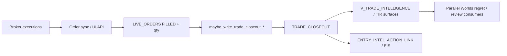

# Closeout / TIR / Parallel Worlds feedback path (Phase 4 diagnostic)

**Anchor:** Broker-truth executions (`MIP.LIVE.BROKER_SNAPSHOTS`, `SNAPSHOT_TYPE = 'EXECUTION'`) for DUQ101771 post-reset cohort. **MIP learning at trade grain** expects **`TRADE_CLOSEOUT`** and downstream views — not portfolio-day PW alone.

---

## 1. Intended flow (happy path)

1. **Broker truth:** IBKR fills appear in snapshots / manual or automated sync.
2. **`LIVE_ORDERS`:** Rows updated to **`STATUS = 'FILLED'`** with **`QTY_FILLED`** consistent with **`QTY_ORDERED`** (protective path).
3. **Hooks (only on transition to FILLED):**  
   - `MIP/apps/mip_ui_api/app/routers/live.py` — order status update handler (~11195–11206): if `target_status == "FILLED"`, calls  
     - `maybe_write_trade_closeout_on_protective_leg_filled(cur, order_id)` **or**  
     - `maybe_write_trade_closeout_on_exit_filled(cur, str(action_id))`.  
   - `MIP/apps/mip_ui_api/app/entry_intel_hooks.py` — implementations (~467+).
4. **`TRADE_CLOSEOUT`:** Inserted once per **`ENTRY_ACTION_ID`** (idempotent).
5. **TIR / intelligence:** Closeout-grain views and APIs consume **`TRADE_CLOSEOUT`** (+ linked EIS).
6. **PW / regret:** Trade-review layers that depend on closeout outcome join through the same grain.

---

## 2. Hook prerequisites (where it stops if unmet)

### Exit-leg path — `maybe_write_trade_closeout_on_exit_filled`

| Stage | Requirement | If missing |
|-------|-------------|------------|
| Exit action | `LIVE_ACTIONS.ACTION_ID` = exit, **`ACTION_INTENT = 'EXIT'`** | `skipped` / `action_intent_not_exit` |
| Entry pairing | Latest **`ENTRY`** with **`STATUS = 'EXECUTED'`** for same portfolio/symbol with `UPDATED_AT` before exit row | **`no_matching_entry_action`** → **no closeout** |
| Fills | `_aggregate_fills_for_action` on exit action — needs **`QTY_FILLED > 0`** on orders linked to action | Skips insert path / no aggregates |
| Duplicate | No existing `TRADE_CLOSEOUT` for `ENTRY_ACTION_ID` | `duplicate_closeout` |

**Critical:** The hook is only invoked from the API path that sets **`LIVE_ORDERS` → FILLED**. If broker has executions but **`LIVE_ORDERS` never reaches FILLED** (or **`QTY_FILLED`** stays 0), **closeout never runs**.

### Protective-leg path — `maybe_write_trade_closeout_on_protective_leg_filled`

| Stage | Requirement | If missing |
|-------|-------------|------------|
| Order | `LIVE_ORDERS.ORDER_ID` exists | `order_not_found` |
| Leg type | Order classified as protective (TP/SL bracket leg) | `not_protective_leg` |
| Status | **`STATUS == 'FILLED'`** | **`order_not_filled`** |
| Quantities | `QTY_FILLED >= QTY_ORDERED` when ordered > 0 | `incomplete_fill` |
| Entry action | Linked **`LIVE_ACTIONS`** **ENTRY** with **`STATUS = 'EXECUTED'`** | `entry_not_executed` |

---

## 3. Cohort evidence (Phase 3 / 4)

For the **8 closed FIFO losers**, SQL joins showed:

- **Broker executions present** in `BROKER_SNAPSHOTS`.
- **`LIVE_ORDERS`** often **not FILLED** / **null fills** vs broker truth.
- **`TRADE_CLOSEOUT`** **absent**; **`ENTRY_INTEL_ACTION_LINK`** gaps consistent with **closeout never written**.

**First broken stage (matrix answer):** **`LIVE_ORDERS` fill state persistence / FILLED transition** (and/or qty sync) **before** closeout hooks — not “PW missing” as root cause.

---

## 4. Exact missing transitions (summary list)

1. **Broker execution → `LIVE_ORDERS` FILLED + non-zero `QTY_FILLED`** — **broken or incomplete** for cohort exits/legs.  
2. **`LIVE_ORDERS` FILLED → `maybe_write_trade_closeout_*` invoked** — does not occur reliably if (1) fails.  
3. **Hook → `TRADE_CLOSEOUT` insert** — never reached for these trades.  
4. **`TRADE_CLOSEOUT` → TIR / regret surfaces** — downstream starvation by design when (3) missing.

---

## 5. Non-conflation note

**Parallel Worlds** at **portfolio day** grain can still exist **without** per-trade closeouts. **Do not** infer “no real trades” from “no PW row”; **broker truth** remains the anchor for **realized** outcomes.
