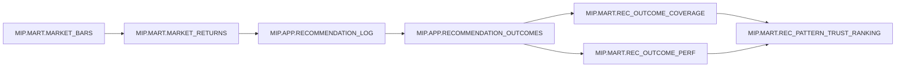
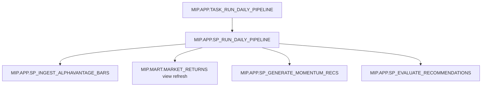

# MIP Data Lineage

## End-to-end lineage narrative
1. **Ingestion**: `MIP.APP.SP_INGEST_ALPHAVANTAGE_BARS` fetches daily bars from AlphaVantage and upserts them into `MIP.MART.MARKET_BARS` using a `MERGE` keyed by `(MARKET_TYPE, SYMBOL, INTERVAL_MINUTES, TS)`.【F:SQL/app/030_sp_ingest_alphavantage_bars.sql†L407-L450】
2. **Returns calculation**: `MIP.MART.MARKET_RETURNS` is (re)built from `MARKET_BARS`, deduping by key and computing simple and log returns per bar.【F:SQL/mart/010_mart_market_bars.sql†L48-L107】
3. **Recommendation generation**: `MIP.APP.SP_GENERATE_MOMENTUM_RECS` writes new recommendation rows into `MIP.APP.RECOMMENDATION_LOG` based on filtered market returns and configured patterns.【F:SQL/app/070_sp_generate_momentum_recs.sql†L1-L235】
4. **Outcome evaluation**: `MIP.APP.SP_EVALUATE_RECOMMENDATIONS` creates horizon-based outcomes in `MIP.APP.RECOMMENDATION_OUTCOMES` using a `MERGE`, ensuring idempotent upserts for each `(RECOMMENDATION_ID, HORIZON_BARS)` pair.【F:SQL/app/105_sp_evaluate_recommendations.sql†L7-L154】
5. **KPI views**: Coverage, performance, and trust ranking are derived from outcomes and the recommendation log, and published as views in `MIP.MART` for reporting and controlling audiences.【F:SQL/mart/030_mart_rec_outcome_views.sql†L1-L82】

## Mermaid diagram: data flow

## Mermaid diagram: orchestration flow

## Idempotency approach
- **Upserted ingestion**: ingestion uses a `MERGE` on the market bar key to avoid duplicates and allow safe re-runs.【F:SQL/app/030_sp_ingest_alphavantage_bars.sql†L407-L450】
- **Rebuild-friendly returns**: the returns view is created or replaced from source bars, so a re-run recomputes the latest state deterministically.【F:SQL/mart/010_mart_market_bars.sql†L48-L107】
- **Outcome upserts**: evaluation uses `MERGE` keyed by `(RECOMMENDATION_ID, HORIZON_BARS)` to update or insert outcomes per horizon, keeping the table consistent across backfills or re-runs.【F:SQL/app/105_sp_evaluate_recommendations.sql†L7-L154】

## Known unknowns / TODO
- **Missing from repo:** None identified for the objects explicitly requested in this documentation pack.
