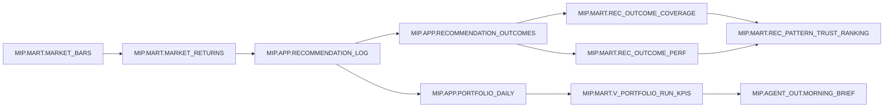
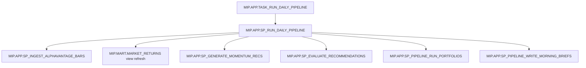

# MIP Data Lineage

## End-to-end lineage narrative
1. **Ingestion**: `MIP.APP.SP_INGEST_ALPHAVANTAGE_BARS` fetches daily bars from AlphaVantage and upserts them into `MIP.MART.MARKET_BARS` using a `MERGE` keyed by `(MARKET_TYPE, SYMBOL, INTERVAL_MINUTES, TS)`.【F:SQL/app/030_sp_ingest_alphavantage_bars.sql†L407-L450】
2. **Returns calculation**: `MIP.MART.MARKET_RETURNS` is (re)built from `MARKET_BARS`, deduping by key and computing simple and log returns per bar.【F:SQL/mart/010_mart_market_bars.sql†L48-L107】
3. **Recommendation generation (ETF included)**: `MIP.APP.SP_PIPELINE_GENERATE_RECOMMENDATIONS` calls `SP_GENERATE_MOMENTUM_RECS` for each market type discovered in `MIP.APP.INGEST_UNIVERSE` (STOCK/ETF/FX), writing to `MIP.APP.RECOMMENDATION_LOG`.【F:SQL/app/144_sp_pipeline_generate_recommendations.sql†L1-L120】【F:SQL/app/145_sp_run_daily_pipeline.sql†L31-L80】【F:SQL/app/050_app_core_tables.sql†L10-L83】
4. **Outcome evaluation**: `MIP.APP.SP_EVALUATE_RECOMMENDATIONS` creates horizon-based outcomes in `MIP.APP.RECOMMENDATION_OUTCOMES` using a `MERGE`, ensuring idempotent upserts for each `(RECOMMENDATION_ID, HORIZON_BARS)` pair.【F:SQL/app/105_sp_evaluate_recommendations.sql†L7-L154】
5. **Portfolio simulation**: `MIP.APP.SP_RUN_PORTFOLIO_SIMULATION` consumes portfolio configuration and opportunity signals to populate portfolio positions, trades, and daily equity series, which roll up into run-level KPIs and events views in `MIP.MART`.【F:SQL/app/160_app_portfolio_tables.sql†L71-L170】【F:SQL/app/180_sp_run_portfolio_simulation.sql†L1-L180】【F:SQL/views/mart/v_portfolio_run_kpis.sql†L1-L122】【F:SQL/views/mart/v_portfolio_run_events.sql†L1-L62】
6. **Agent outputs / morning brief**: `MIP.MART.V_MORNING_BRIEF_JSON` composes trusted signals, risk, attribution, and delta changes, and `MIP.APP.SP_WRITE_MORNING_BRIEF` persists the JSON to `MIP.AGENT_OUT.MORNING_BRIEF` for downstream agent consumption.【F:SQL/views/mart/v_morning_brief_json.sql†L1-L139】【F:SQL/views/mart/v_morning_brief_with_delta.sql†L1-L190】【F:SQL/app/186_sp_write_morning_brief.sql†L1-L48】【F:SQL/app/185_agent_out_morning_brief.sql†L1-L17】
7. **KPI views**: Coverage, performance, and trust ranking are derived from outcomes and the recommendation log, and published as views in `MIP.MART` for reporting and controlling audiences.【F:SQL/mart/030_mart_rec_outcome_views.sql†L1-L82】

## Mermaid diagram: data flow

## Mermaid diagram: orchestration flow

## Idempotency approach
- **Upserted ingestion**: ingestion uses a `MERGE` on the market bar key to avoid duplicates and allow safe re-runs.【F:SQL/app/030_sp_ingest_alphavantage_bars.sql†L407-L450】
- **Rebuild-friendly returns**: the returns view is created or replaced from source bars, so a re-run recomputes the latest state deterministically.【F:SQL/mart/010_mart_market_bars.sql†L48-L107】
- **Outcome upserts**: evaluation uses `MERGE` keyed by `(RECOMMENDATION_ID, HORIZON_BARS)` to update or insert outcomes per horizon, keeping the table consistent across backfills or re-runs.【F:SQL/app/105_sp_evaluate_recommendations.sql†L7-L154】

## Known unknowns / TODO
- **Missing from repo:** None identified for the objects explicitly requested in this documentation pack.
