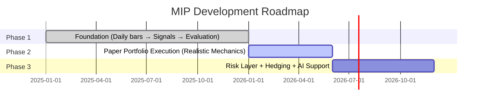
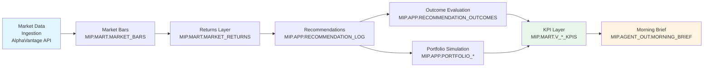

# Market Intelligence Platform (MIP)
## Advertising Deck

**For:** Traders, Market Makers, Investment Bank Leadership  
**Date:** January 2026

---

## Slide 1: Title & Vision

# Market Intelligence Platform (MIP)

### Automated Signal Generation, Portfolio Simulation & AI-Ready Decision Support

**Vision Statement**

MIP transforms raw market data into actionable trading intelligence through automated pattern recognition, systematic evaluation, and portfolio simulation. Built natively on Snowflake, MIP delivers production-ready analytics that scale from daily operations to autonomous decision support.

**Target Audience**
- Traders seeking systematic signal validation and multi-horizon analysis
- Market makers requiring automated pattern discovery across asset classes
- Investment bank leadership evaluating scalable, risk-aware trading infrastructure

---

## Slide 2: What is MIP?

**Core Definition**

MIP (Market Intelligence Platform) is a **Snowflake-native analytics pipeline** that ingests daily market bars, calculates returns, generates recommendations, evaluates outcomes, runs portfolio simulations, and writes morning briefs—all within Snowflake's secure, scalable infrastructure.

### Key Capabilities

- **Automated Daily Market Data Ingestion**
  - Multi-asset support: STOCK, ETF, FX markets
  - External API integration (AlphaVantage) with graceful rate limit handling
  - Idempotent operations ensuring data consistency

- **Pattern-Based Recommendation Generation**
  - Momentum-based signal generation across market types
  - Score calibration and threshold gating
  - Deduplication logic preventing duplicate recommendations

- **Multi-Horizon Outcome Evaluation**
  - Forward-looking evaluation at 1, 3, 5, 10, and 20 bar horizons
  - Realized return calculation with hit rate tracking
  - Coverage metrics indicating recommendation maturity

- **Portfolio Simulation with Risk Controls**
  - Paper trading with drawdown stops and position limits
  - Daily equity tracking and PnL attribution
  - Risk-aware entry/exit logic

- **AI-Ready Morning Briefs**
  - Structured JSON outputs for agent consumption
  - Portfolio status, recommendations, and risk summaries
  - Delta tracking showing changes since last run

**Architecture Highlight**

Fully native to Snowflake—no external runtime dependencies for core pipeline operations. All logic executes as stored procedures, tasks, and views within Snowflake's secure environment.

---

## Slide 3: Current State - Phase 1 Complete

**Status: Foundation Phase Operational and Stable**

### Phase 1 Achievements ✅

**Pipeline Automation**
- ✅ End-to-end daily pipeline automation via `SP_RUN_DAILY_PIPELINE`
- ✅ Scheduled execution via `TASK_RUN_DAILY_PIPELINE` (07:00 Europe/Berlin)
- ✅ Structured audit logging with JSON details for every step

**Multi-Market Support**
- ✅ STOCK, ETF, and FX universe support (24+ symbols across types)
- ✅ AlphaVantage integration with external access
- ✅ Graceful rate limit handling (`SUCCESS_WITH_SKIPS` status)
- ✅ Smart skip logic when no new bars detected (`SKIPPED_NO_NEW_BARS`)

**Signal Generation & Evaluation**
- ✅ Pattern-based recommendations with threshold gating
- ✅ Deduplication preventing duplicate signals for same timestamp
- ✅ Multi-horizon evaluation (1/3/5/10/20 bars) generating hundreds of outcomes per run
- ✅ Outcome tracking with hit rate, average return, and score correlation metrics

**Portfolio Simulation**
- ✅ Portfolio simulation engine creating 4-5 trades per run
- ✅ Drawdown stop mechanism triggering `ALLOW_EXITS_ONLY` regime
- ✅ Position limits and exposure controls
- ✅ Daily equity series, total return, win/loss day tracking

**Observability & Outputs**
- ✅ Comprehensive audit trail in `MIP_AUDIT_LOG`
- ✅ Morning brief generation with structured JSON
- ✅ KPI views for portfolio runs, attribution, and signal quality

**Current Focus**

Stabilizing pipeline behavior under repeated runs and rate limits. Ensuring downstream steps correctly skip when no new data is available, maintaining idempotency across all operations.

---

## Slide 4: Where We Are Now

### Three-Phase Roadmap Progress

**Phase 1: ✅ COMPLETE**
- Foundation: Daily bars → Signals → Evaluation
- Status: Production-ready daily pipeline with portfolio simulation
- Key Deliverable: Reliable, idempotent pipeline generating trustworthy outcome data

**Phase 2: ⏳ IN PROGRESS**
- Paper portfolio execution with realistic mechanics
- Current Focus: Profile tuning knobs and training mode optimization
- Next Unlock: Cash management, transaction costs, enhanced exposure controls

**Phase 3: ⬜ PLANNED**
- Risk layer + Hedging + AI Brief/Suggestions
- Vision: Risk-aware proposals with explainability and autonomous decision support

**Progress Summary**

- **Phase 1 Completion:** ~100% (all core objectives met)
- **Phase 2 Progress:** ~30% (portfolio simulation working, tuning in progress)
- **Phase 3 Progress:** ~10% (morning brief mechanism exists, content upgrade planned)

**Key Milestone Achieved**

Production-ready daily pipeline with portfolio simulation, risk controls, and comprehensive observability. System successfully handles rate limits, detects no-new-bars scenarios, and maintains data integrity across repeated runs.

---

## Slide 5: Technical Architecture Highlights

### Data Flow Pipeline

### Key Components

**Automated Ingestion**
- External API integration via Snowflake external access
- Graceful degradation: rate limit handling, no-new-bars detection
- Idempotent upserts preventing duplicate data

**Multi-Horizon Evaluation**
- Forward-looking analysis at 1, 3, 5, 10, 20 bar horizons
- Realized return calculation with entry/exit price tracking
- Coverage metrics indicating data maturity

**Portfolio Simulation Engine**
- Paper trading with realistic constraints
- Drawdown stops triggering regime changes
- Position limits and exposure controls
- Daily equity series and PnL attribution

**KPI Layer**
- Portfolio run KPIs (returns, volatility, drawdown, win/loss days)
- Attribution by symbol, pattern, and market type
- Signal quality metrics (hit rate, score correlation, coverage)
- Training leaderboards for pattern performance

**Agent-Ready Outputs**
- Structured JSON morning briefs
- Portfolio status, recommendations, risk summaries
- Delta tracking for change detection

### Infrastructure

**Snowflake-Native Architecture**
- Stored procedures for orchestration (`SP_RUN_DAILY_PIPELINE`)
- Scheduled tasks for automation (`TASK_RUN_DAILY_PIPELINE`)
- Views for analytics and reporting (`MIP.MART.V_*`)
- Schemas organized by responsibility (RAW_EXT, MART, APP, AGENT_OUT)

**Security & Roles**
- Role-based access: `MIP_ADMIN_ROLE`, `MIP_APP_ROLE`, `MIP_AGENT_READ_ROLE`
- Dedicated warehouse: `MIP_WH_XS` for ingestion, analytics, and Streamlit

---

## Slide 6: Value Proposition - For Traders

### Signal Quality & Validation

**Pattern-Based Recommendations**
- Systematic momentum pattern identification
- Score calibration with decile-based expected returns
- Threshold gating filtering low-confidence signals
- Deduplication ensuring one signal per symbol/timestamp

**Multi-Horizon Analysis**
- Evaluate signals across 1, 3, 5, 10, 20 bar horizons simultaneously
- Forward-looking realized return tracking
- Coverage metrics showing recommendation maturity
- Hit rate calculation by threshold (default: non-negative returns)

**Training KPIs for Pattern Validation**
- Hit rate: success rate by pattern and horizon
- Average return: mean realized outcome
- Sharpe-like metrics: risk-adjusted performance indicators
- Score-return correlation: validates model calibration
- Training leaderboards: rank patterns by performance (requires n_success ≥ 30)

**Attribution & Performance Tracking**
- PnL attribution by symbol, pattern, and market type
- Roundtrip analysis: win rate, average PnL per trade
- Contribution percentage: which signals drive portfolio performance
- Pattern-level attribution: understand which strategies work

**Risk Awareness**
- Drawdown stops: automatic regime switching to `ALLOW_EXITS_ONLY`
- Position limits: maximum positions and position sizing constraints
- Exposure controls: per asset class and symbol caps
- Daily volatility tracking and risk event monitoring

**Operational Benefits**
- Automated daily pipeline: no manual intervention required
- Structured audit logs: complete lineage and observability
- Idempotent operations: safe to re-run without data corruption
- Production-ready: handling rate limits and edge cases gracefully

---

## Slide 7: Value Proposition - For Market Makers

### Automated Discovery & Systematic Trading

**Automated Pattern Discovery**
- Systematic pattern identification across asset classes (STOCK, ETF, FX)
- Multi-market support: 24+ symbols across market types
- Pattern-based signal generation with score calibration
- Training views enabling pattern performance validation

**Portfolio Simulation with Realistic Constraints**
- Paper trading engine with drawdown stops and position limits
- Daily equity tracking and PnL calculation
- Trade generation: 4-5 trades per run with realistic mechanics
- Risk-aware entry/exit logic preventing overexposure

**Comprehensive Performance Tracking**
- Portfolio KPIs: total return, daily volatility, max drawdown
- Win/loss day analysis: average win/loss PnL
- Time in market: share of days with open positions
- Attribution: symbol-level and pattern-level PnL contribution

**Multi-Asset Support**
- STOCK, ETF, FX coverage in single unified system
- Market-type agnostic logic: no hardcoding of asset classes
- Consistent evaluation framework across all market types
- Flexible universe configuration via seed tables

**Complete Audit Trail**
- Structured audit logging: every pipeline step logged with JSON details
- Data lineage: clear traceability from ingestion to portfolio outcomes
- Observability: runbook queries answering "is it healthy?" in <30 seconds
- Idempotency: safe re-runs without duplicate data or corrupted state

**Scalable Infrastructure**
- Snowflake-native: no external runtime dependencies
- Cloud-ready: scales with Snowflake warehouse sizing
- Automated scheduling: daily task execution without manual intervention
- Secure: role-based access control and dedicated warehouse

---

## Slide 8: Value Proposition - For Investment Bank Leadership

### Operational Excellence & Strategic Vision

**Operational Efficiency**
- **Fully Automated Daily Pipeline**: Zero manual intervention required
  - Scheduled execution at 07:00 Europe/Berlin
  - Graceful handling of rate limits and edge cases
  - Smart skip logic when no new data available
  - Complete observability via structured audit logs

**Scalable, Cloud-Ready Architecture**
- **Snowflake-Native Infrastructure**: No external runtime dependencies
  - All logic executes within Snowflake's secure environment
  - Scales with warehouse sizing (currently XS, easily upgradeable)
  - Role-based access control with dedicated roles and warehouses
  - Cloud-native design supporting enterprise security requirements

**Built-In Risk Management**
- **Drawdown Stops**: Automatic regime switching when thresholds breached
- **Position Limits**: Maximum positions and position sizing constraints
- **Exposure Controls**: Per asset class and symbol caps
- **Risk Event Tracking**: Structured logging of stop events and drawdown breaches

**AI-Ready Foundation**
- **Structured Outputs**: JSON morning briefs designed for agent consumption
- **Agent Catalog**: Defined read-only agents (Performance Analyst, Risk Observer, Attribution Narrator)
- **Future-Proof Design**: Clear path to autonomous decision support
- **Explainability Ready**: Attribution and rationale tracking built into data model

**Clear Roadmap to Autonomous Intelligence**
- **Phase 1 Complete**: Production-ready foundation
- **Phase 2 In Progress**: Realistic execution mechanics
- **Phase 3 Vision**: Risk layer, hedging, AI decision support
- **Measurable Progress**: Transparent roadmap with defined success criteria

**Strategic Value**
- **Competitive Advantage**: Systematic pattern discovery at scale
- **Risk-Aware**: Built-in controls preventing catastrophic losses
- **Data-Driven**: Comprehensive KPIs enabling evidence-based decisions
- **Future Investment**: Foundation for AI-powered trading intelligence

---

## Slide 9: Ambitious Goals - Phase 2 (In Progress)

### Paper Portfolio Execution with Realistic Mechanics

**Current Status: ⏳ IN PROGRESS**

Phase 2 transforms signals into a consistent, realistic simulated trading process with proper execution mechanics and cash management.

### Phase 2 Objectives

**Cash Account Management**
- Realistic position sizing based on available cash (not just target weight)
- Cash tracking: starting cash, available cash, cash utilization
- Position sizing constraints: max position percentage, total exposure limits

**Transaction Costs & Slippage**
- Simple basis points (bps) model for transaction costs
- Slippage modeling for realistic execution
- Cost attribution: track transaction costs per trade and pattern

**Order Lifecycle Simulation**
- Signal → Proposal → Execution → Fills workflow
- Proposal validation: constraints checking before execution
- Execution simulation: realistic fill modeling
- Order status tracking: pending, filled, rejected, cancelled

**Enhanced Exposure Controls**
- Per asset class exposure caps (STOCK, ETF, FX)
- Per symbol concentration limits
- Correlation-based exposure rules (for ETFs)
- Sector-level exposure controls

**Portfolio PnL Attribution**
- Attribution by signal/pattern/asset class
- Realized vs unrealized PnL tracking
- Contribution analysis: which signals drive performance
- Pattern-level performance validation

### Current Phase 2 Progress

**✅ Completed**
- Portfolio simulation engine running
- Drawdown stops working (triggers `ALLOW_EXITS_ONLY` regime)
- Trade generation (4-5 trades per run)
- Morning brief production

**⏳ In Progress**
- Profile tuning knobs: initial cash, max_positions, max_position_pct, drawdown_stop_pct
- Training mode profile: less strict drawdown stop for learning iteration
- Enhanced logging for systematic experimentation

**⬜ Backlog**
- Transaction costs and slippage modeling
- Exposure rules per asset class/correlation/sector
- Cash account management refinements

**Timeline**

Currently stabilizing Phase 1 edge cases while beginning Phase 2 development. Focus on enabling training iteration by tuning portfolio profiles to generate sufficient trade volume for pattern validation.

---

## Slide 10: Ambitious Goals - Phase 3 (Vision)

### Risk Layer + Hedging + AI Decision Support

**Status: ⬜ PLANNED**

Phase 3 elevates MIP from a signal generation system to an autonomous, risk-aware decision support platform with explainability and AI-powered recommendations.

### Risk Layer

**Daily Risk Summaries**
- Exposure by market type: STOCK, ETF, FX breakdown
- Concentration metrics: position concentration, symbol-level exposure
- Recent volatility tracking: rolling volatility windows
- Drawdown trajectory: current drawdown vs historical patterns

**Volatility Targeting**
- Daily VaR proxy: value-at-risk estimation
- Volatility-adjusted position sizing
- Risk budget allocation across strategies
- Dynamic risk scaling based on market conditions

**Drawdown Regime Controls**
- Enhanced drawdown stop logic with regime detection
- Regime-based position sizing (reduce size in high drawdown periods)
- Recovery mode: gradual position rebuilding after stops
- Stress scenario preparation

**Stress Scenario Analysis**
- "What if" scenarios: volatility doubles, gap down events, correlation spikes
- Scenario-based position sizing adjustments
- Stress test reporting for risk committees

### Hedging Logic

**Index Hedging via ETFs**
- Automatic index hedge calculation when equity drawdown rising
- ETF-based hedging for market exposure reduction
- Correlation-based hedge ratio optimization
- Hedge effectiveness tracking

**FX Hedging for USD Exposure**
- Currency exposure calculation
- FX hedge rules for non-USD positions
- Hedge instrument selection (currency pairs, FX ETFs)
- Cost-benefit analysis of hedging decisions

**Dynamic Hedging**
- Real-time hedge ratio adjustments
- Correlation-based hedge optimization
- Cost-aware hedging: transaction costs vs risk reduction

### AI Decision Support

**Explainability: Rationale per Recommendation & Trade**
- Pattern rationale: why this pattern triggered
- Score explanation: what factors drove the score
- Trade rationale: why this trade was proposed/executed/rejected
- Attribution explanation: what drove this PnL outcome

**AI Morning Brief: "What Changed, Why, What to Do Next"**
- **What Changed**: Delta tracking since last run
  - New recommendations, updated outcomes, portfolio changes
  - Risk metric shifts, drawdown trajectory changes
- **Why**: Contextual explanations
  - Why entries were blocked (drawdown stop, position limits, etc.)
  - Why certain patterns are performing well/poorly
  - Market context affecting signal quality
- **What to Do Next**: Actionable recommendations
  - Top candidates with rationale
  - Risk adjustments needed
  - Pattern tuning suggestions

**Multi-Agent Roles (Structured Framework)**
- **Signal Scout**: Identifies opportunities, ranks candidates, explains patterns
- **Risk Officer**: Monitors stops, blocks entries, explains risk constraints
- **Portfolio Manager**: Sizing decisions, rotation suggestions, attribution analysis
- **Market Context**: News/sentiment integration (future phase)

**News/Sentiment Integration (Future)**
- External news feed integration
- Sentiment analysis for market context
- Event-driven signal adjustments
- News-based risk regime detection

### Vision Statement

Transform MIP from a signal generator into an **autonomous market intelligence system** that not only identifies opportunities but explains why, manages risk proactively, and provides actionable recommendations with full transparency.

---

## Slide 11: Key Metrics & KPIs

### Signal Quality Metrics

**Coverage Rate (Maturity Indicator)**
- Measures what percentage of recommendations have "matured" (enough future bars exist for evaluation)
- Coverage rate near 1.0 indicates complete evaluation dataset
- Available by pattern, market type, interval, and horizon
- Source: `MIP.MART.V_SIGNAL_OUTCOME_KPIS.COVERAGE_RATE`

**Hit Rate (Success Rate)**
- Percentage of recommendations meeting minimum return threshold
- Default threshold: 0.0 (any non-negative return is a "hit")
- Configurable threshold for different success criteria
- Available by pattern, horizon, and market type
- Source: `MIP.MART.V_SIGNAL_OUTCOME_KPIS.HIT_RATE`

**Score-Return Correlation**
- Correlation between recommendation score and realized return
- Positive correlation: higher scores predict better outcomes
- Near zero: score not informative (needs recalibration)
- Negative correlation: score inversely related to performance
- Source: `MIP.MART.V_SIGNAL_OUTCOME_KPIS.SCORE_RETURN_CORR`

**Return Distribution Statistics**
- Average return: mean realized outcome
- Median return: median realized outcome (robust to outliers)
- Standard deviation: volatility of returns
- Min/max returns: worst and best case outcomes
- Average win vs average loss: win/loss asymmetry
- Source: `MIP.MART.V_SIGNAL_OUTCOME_KPIS`

**Training Leaderboards**
- Ranked patterns by Sharpe-like metrics, hit rate, average return
- Filtered to patterns with sufficient sample size (n_success ≥ 30)
- Enables identification of best-performing patterns
- Source: `MIP.MART.V_TRAINING_LEADERBOARD`

### Portfolio Metrics

**Return Metrics**
- Total return: `(final_equity / starting_cash) - 1`
- Average daily return: mean daily return
- Daily volatility: standard deviation of daily returns
- Source: `MIP.MART.V_PORTFOLIO_RUN_KPIS`

**Risk Metrics**
- Max drawdown: maximum peak-to-trough decline
- Peak equity: highest equity value achieved
- Min equity: lowest equity value (drawdown trough)
- Drawdown stop timestamp: when drawdown threshold breached
- Source: `MIP.MART.V_PORTFOLIO_RUN_KPIS`

**Trading Activity Metrics**
- Win days vs loss days: count and average PnL
- Average open positions: mean position count
- Time in market: share of days with open positions > 0
- Trading days: total number of trading days in run
- Source: `MIP.MART.V_PORTFOLIO_RUN_KPIS`

**Attribution Metrics**
- Total realized PnL by symbol, pattern, market type
- Contribution percentage: each component's share of total PnL
- Win rate: percentage of profitable trades
- Average PnL per trade: mean realized PnL
- Roundtrips: number of completed trades
- Source: `MIP.MART.V_PORTFOLIO_ATTRIBUTION`, `V_PORTFOLIO_ATTRIBUTION_BY_PATTERN`

### Training Metrics

**Pattern Performance KPIs**
- Signal count: total recommendations generated
- Success count: matured outcomes with realized returns
- Hit rate: success rate by threshold
- Average/median return: central tendency metrics
- Sharpe-like metrics: risk-adjusted performance
- Last signal timestamp: recency indicator
- Source: `MIP.MART.V_TRAINING_KPIS`

**Score Calibration**
- Decile-based expected returns: score buckets with performance
- Calibration quality: how well scores predict outcomes
- Source: `MIP.MART.V_SCORE_CALIBRATION`, `V_SIGNALS_WITH_EXPECTED_RETURN`

---

## Slide 12: Current Capabilities Demo

### Production-Ready Daily Operations

**Automated Daily Pipeline**

The system runs end-to-end daily without manual intervention:

1. **Ingestion** → AlphaVantage API calls, graceful rate limit handling
2. **Returns Refresh** → Rebuilds returns layer from latest bars
3. **Recommendation Generation** → Pattern-based signals across STOCK/ETF/FX
4. **Outcome Evaluation** → Multi-horizon forward returns (1/3/5/10/20 bars)
5. **Portfolio Simulation** → Paper trading with risk controls
6. **Morning Brief** → Structured JSON output for agents

**Portfolio Simulation in Action**

- **Real-Time Risk Controls**: Drawdown stops automatically trigger `ALLOW_EXITS_ONLY` regime
- **Trade Generation**: 4-5 trades per run with realistic position sizing
- **Daily Equity Tracking**: Complete equity series with total return calculation
- **PnL Attribution**: Symbol-level and pattern-level performance attribution
- **Event Tracking**: Drawdown stop events, flat position timestamps logged

**Morning Brief Output**

Structured JSON containing:
- Portfolio status: equity, positions, cash, exposure
- Recommendations: top candidates with scores and rationale
- Risk summary: drawdown, volatility, stop status
- Deltas: what changed since last run
- Ready for AI agent consumption

**Training Views & Leaderboards**

- **Signal Outcomes**: One row per recommendation-horizon with realized returns
- **Training KPIs**: Aggregated metrics by pattern, market type, horizon
- **Leaderboards**: Ranked patterns by Sharpe-like metrics (n_success ≥ 30)
- **Score Calibration**: Decile-based expected returns for score interpretation

**Observability & Audit Trail**

- **Structured Audit Logs**: Every pipeline step logged with JSON details
- **Runbook Queries**: Answer "is it healthy?" in <30 seconds
- **Data Lineage**: Clear traceability from ingestion to outcomes
- **Idempotency**: Safe re-runs without duplicate data

**Status: Production-Ready**

The system is operational and handling:
- ✅ Rate limits gracefully (`SUCCESS_WITH_SKIPS`)
- ✅ No-new-bars scenarios (`SKIPPED_NO_NEW_BARS`)
- ✅ Drawdown stops triggering regime changes
- ✅ Idempotent operations across repeated runs
- ✅ Comprehensive observability via audit logs

---

## Slide 13: Next Steps & Roadmap

### Immediate Priorities (Phase 2)

**Profile Tuning & Training Mode**
- Add profile tuning knobs: initial cash, max_positions, max_position_pct, drawdown_stop_pct, bust_equity_pct
- Create controlled "training mode" profile:
  - Less strict drawdown stop for learning iteration
  - Smaller position sizing
  - Fewer symbols or fewer candidates per day
- Enhanced logging for systematic experimentation

**Cash Management & Position Sizing**
- Realistic position sizing based on available cash (not just target weight)
- Cash account tracking: starting, available, utilized
- Position sizing constraints enforcement

**Transaction Cost Modeling**
- Simple basis points (bps) model for transaction costs
- Slippage modeling for realistic execution
- Cost attribution per trade and pattern

### Near-Term (Phase 2 Completion)

**Order Lifecycle Simulation**
- Signal → Proposal → Execution → Fills workflow
- Proposal validation with constraint checking
- Execution simulation with realistic fill modeling
- Order status tracking

**Enhanced Exposure Controls**
- Per asset class exposure caps
- Per symbol concentration limits
- Correlation-based exposure rules (for ETFs)
- Sector-level exposure controls

**Portfolio Attribution Enhancements**
- Enhanced PnL attribution by signal/pattern/asset class
- Realized vs unrealized PnL tracking
- Pattern-level performance validation improvements

### Future Vision (Phase 3)

**Risk Layer Development**
- Daily VaR proxy and volatility targeting
- Enhanced drawdown regime controls
- Stress scenario analysis ("what if" modeling)
- Risk budget allocation

**Hedging Automation**
- Index hedging via ETFs
- FX hedging for USD exposure
- Dynamic hedge ratio optimization
- Hedge effectiveness tracking

**AI-Powered Decision Support**
- Explainability: rationale per recommendation and trade
- Enhanced AI Morning Brief: "what changed, why, what to do next"
- Multi-agent roles: Signal Scout, Risk Officer, Portfolio Manager
- News/sentiment integration (future phase)

**Timeline Estimate**

- **Phase 2 Completion**: Q2 2026 (focus on cash management, transaction costs, exposure controls)
- **Phase 3 Initiation**: Q3 2026 (risk layer, hedging logic)
- **Phase 3 Completion**: Q4 2026 (AI decision support, explainability)

**Success Criteria**

- Phase 2: Realistic paper trading with transaction costs and cash management
- Phase 3: Risk-aware proposals with full explainability and AI recommendations

---

## Slide 14: Call to Action / Closing

### Current Status

**Phase 1: ✅ COMPLETE**
- Production-ready daily pipeline
- Multi-market signal generation and evaluation
- Portfolio simulation with risk controls
- Comprehensive observability and audit trail

**Phase 2: ⏳ IN PROGRESS**
- Portfolio simulation operational
- Focus on profile tuning and training mode optimization
- Next: Cash management, transaction costs, enhanced exposure controls

**Phase 3: ⬜ PLANNED**
- Risk layer with VaR and stress testing
- Hedging automation
- AI-powered decision support with explainability

### Ready For

- **Daily Operations**: Automated pipeline running reliably
- **Pattern Validation**: Training views and leaderboards enabling systematic pattern evaluation
- **Portfolio Simulation**: Paper trading with risk controls for strategy testing
- **AI Integration**: Structured outputs ready for agent consumption

### Vision

**Autonomous Market Intelligence with AI Decision Support**

MIP is evolving from a signal generation system to an autonomous, risk-aware trading intelligence platform that:
- Identifies opportunities systematically across asset classes
- Explains why recommendations are made (explainability)
- Manages risk proactively with built-in controls
- Provides actionable recommendations with full transparency
- Scales from daily operations to AI-powered decision support

### Next Steps

**For Traders & Market Makers**
- Explore training views and leaderboards to identify best-performing patterns
- Review portfolio simulation results and attribution analysis
- Provide feedback on signal quality and evaluation metrics

**For Investment Bank Leadership**
- Review Phase 1 achievements and Phase 2/3 roadmap
- Evaluate strategic value and resource allocation
- Discuss integration with existing trading infrastructure

**For Development Team**
- Continue Phase 2 development: cash management, transaction costs
- Begin Phase 3 planning: risk layer architecture, hedging logic design
- Enhance morning brief content: status → insight transformation

---

**Contact & Questions**

For technical details, see: `MIP/docs/`  
For architecture overview: `MIP/docs/10_ARCHITECTURE.md`  
For roadmap status: `MIP/docs/ROADMAP_CHECKLIST.md`

---

*Market Intelligence Platform (MIP) - Transforming Market Data into Trading Intelligence*
