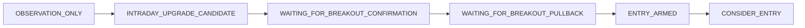

# Phase D1 — BROOKS_CONTEXT_RULESET_V0_3 Deterministic Design

**Status:** D1 approved; D2/D3 implemented and synthetically certified (2026-08-04).  
**Ruleset ID:** `BROOKS_CONTEXT_RULESET_V0_3`  
**Isolation:** New modules only (`context_ruleset_v03.py`, `context_engine_v03.py`); V0.2 files untouched; Freeze V1 stays on V0.2; resolver has a non-default V0.3 branch (inactive by default).  
**Evidence:** `cursorfiles/brooks_phase_d_v03_certification.json`  
**Out of scope for Phase D:** week-3 resume, historical replay, Freeze V2, pointing existing runs at V0.3, live/order paths.

## Lab timing confirmed (anchors)

| Fact | Value | Source |
|---|---|---|
| Bar size | 5 minutes | Lab standard |
| Full RTH | 78 bars, indices `0..77` (09:30–15:55 open) | [`interval_validation.py`](MIP/apps/mip_ui_api/app/brooks_intraday/interval_validation.py) |
| Forced flatten | Final bar close → `FORCED_END_OF_DAY_EXIT` | [`simulation_engine.py`](MIP/apps/mip_ui_api/app/brooks_intraday/simulation_engine.py) |
| Existing sim entry cutoff | `last_entry_bar_index_in_session = 72` (bar open **15:30 ET**) | [`simulation_ruleset_v01.py`](MIP/apps/mip_ui_api/app/brooks_intraday/simulation_ruleset_v01.py) |

**V0.3 choice (implemented):** Context entry authorization uses the **same cutoff as simulation**: `LAST_ENTRY_BAR_INDEX_IN_SESSION = 72`.  
**Clock meaning:** bar index 72 opens at **15:30 ET**, leaving approximately **30 minutes** before forced EOD flatten on the final bar close (index 77).  
Rationale: avoid arming `CONSIDER_ENTRY` that sim would immediately reject; the sim comment “~15:00” is stale. Blocker: `INSUFFICIENT_TIME_REMAINING` when `bar_index_in_session > 72`. Applies to both daily-thesis and intraday-upgrade paths.

---

## Verdict classes

| Class | Lab verdicts | V0.3 meaning |
|---|---|---|
| `AUTHORIZED_DAILY` | `WAIT_PULLBACK`, `LONG_APPROVE`, `LONG_APPROVE_REDUCED`, `WAIT_RECLAIM` (+ aliases `LONG_BIAS`→`LONG_APPROVE`, `SUPPORT_HOLD`→`WAIT_PULLBACK`, `RECLAIM_REQUIRED`→`WAIT_RECLAIM` if ever emitted) | Standard V0.2-style thesis path (conservative; no intentional behaviour change except shared time/DNC/room-after-break policies below) |
| `NO_CLEAR_LONG` | `NO_CLEAR_LONG` | No initial daily entry authorization; may earn authorization only via upgrade path |
| `DEFER` | `DEFER` | Hard-blocked all day |
| `OTHER` | anything else | Treated as observation / no daily auth |

**DEFER vs NO_CLEAR_LONG**

- **DEFER:** Daily process deferred — Lab must not invent a long thesis. Always `DO_NOT_ENTER` + `DEFERRED_BY_DAILY_THESIS`. No upgrade.
- **NO_CLEAR_LONG:** No clear daily long at open — not a permanent veto. Starts `OBSERVATION_ONLY` + `NO_DAILY_LONG_AUTHORIZATION`; may progress through upgrade states only.

---

## New / retained advisory states

**New (upgrade path):**  
`INTRADAY_UPGRADE_CANDIDATE`, `WAITING_FOR_BREAKOUT_CONFIRMATION`, `WAITING_FOR_BREAKOUT_PULLBACK`, `FAILED_BREAKOUT`

**Retained (existing meanings):**  
`OBSERVATION_ONLY`, `ENTRY_ARMED`, `ENTRY_BLOCKED`, `DO_NOT_CHASE`, plus V0.2 daily-path states (`WAITING_FOR_PULLBACK`, `WAITING_FOR_RECLAIM`, `SETUP_DEVELOPING`, `THESIS_INVALIDATED`, etc.)

**Required upgrade progression (no skips to ENTRY_ARMED/CONSIDER_ENTRY):**

Resistance lifecycle (orthogonal to advisory state):  
`UNBROKEN` → `BROKEN_PENDING_CONFIRMATION` → `BROKEN_CONFIRMED` | `FAILED_BREAKOUT`

---

## Exact numerical thresholds

All fractions use **session range** unless noted:  
`session_range = max(session_high - session_low, current_bar_range)` (same denominator style as V0.2 room).

| Constant | Value | Unit | Purpose |
|---|---|---|---|
| `MIN_ROOM_ACCEPTABLE_FRACTION` | **0.35** | session ranges | Unchanged from V0.2 — acceptable room to **active** resistance |
| `MIN_ROOM_AMPLE_FRACTION` | **0.55** | session ranges | Unchanged from V0.2 — ample room |
| `RESISTANCE_PROXIMITY_FRACTION` | **0.12** | session ranges | Unchanged — “at / immediately below” unbroken resistance |
| `BREAKOUT_CONFIRM_WINDOW_BARS` (N) | **3** | bars | Route A follow-through window after candidate bar |
| `BREAKOUT_ACCEPTANCE_CLOSES` (M) | **2** | consecutive closes | Route B consolidation acceptance |
| `BREAKOUT_FAIL_TOLERANCE_FRACTION` | **0.05** | session ranges | Material close below broken level (wicks alone do not fail) |
| `PULLBACK_RETEST_TOLERANCE_FRACTION` | **0.08** | session ranges | How close price must approach breakout support for a valid retest |
| `PULLBACK_HOLD_TOLERANCE_FRACTION` | **0.05** | session ranges | Max close below broken resistance during pullback without failure |
| `CONSOLIDATION_MIN_BARS` | **4** | bars | Min bars above resistance for consolidation arming path |
| `CONSOLIDATION_MAX_RANGE_FRACTION` | **0.35** | of post-break swing range | Range contraction gate |
| `CONSOLIDATION_DIP_TOLERANCE_FRACTION` | **0.05** | session ranges | Allowed dip vs broken resistance during consolidation |
| `CONSOLIDATION_EXPIRY_BARS` | **12** | bars | Consolidation path expiry after confirmation |
| `DNC_EXTENSION_FROM_BREAK_FRACTION` | **0.55** | session ranges | Extension above broken resistance → DNC (aligns with ample threshold philosophy) |
| `DNC_CONSECUTIVE_BULL_BARS` | **3** | bars | Large consecutive bulls without pullback → DNC |
| `DNC_LARGE_BAR_FRACTION` | **0.40** | session ranges | “Large” bull bar for consecutive-bull DNC |
| `MAX_ENTRY_RISK_FRACTION` | **0.40** | session ranges | `(close - stop_ref) / session_range` must be ≤ this |
| `MIN_BARS_REMAINING_FOR_ENTRY` | via index | — | `bar_index_in_session ≤ 72` |
| `LAST_ENTRY_BAR_INDEX_IN_SESSION` | **72** | bar index | Match simulation; open 15:30 ET |
| `OPENING_OBSERVATION_BARS` | **3** | bars | Unchanged — no CONSIDER_ENTRY in opening |
| `EXPIRY_UPGRADE_CANDIDATE_BARS` | **6** | bars | Max life in `INTRADAY_UPGRADE_CANDIDATE` |
| `EXPIRY_BREAKOUT_CONFIRMATION_BARS` | **3** | bars | Max life in `WAITING_FOR_BREAKOUT_CONFIRMATION` (= N) |
| `EXPIRY_BREAKOUT_PULLBACK_BARS` | **12** | bars | Max life in `WAITING_FOR_BREAKOUT_PULLBACK` |
| `GAP_ACCEPTANCE_CLOSES` | **2** | consecutive closes | Gap-above-resistance must accept above open resistance before upgrade progresses |
| `BEAR_REVERSAL_NEAR_LOW_FRACTION` | **0.25** | bar range | Close in bottom 25% for strong bear bar |
| `CLOSE_NEAR_HIGH_TOP_FRACTION` | **0.25** | bar range | Matches objective ruleset close-near-high |
| `SYMBOL_PRIORITY` | AAPL, AMZN, JPM, MCD | fixed order | Tie-break last key |

**Justification highlights**

- **N=3 / M=2:** Minimum structural confirmation without allowing same-bar arming; M=2 matches V0.2 reclaim confirm bar count spirit.
- **Fail/hold tolerance 0.05 SR:** Distinguishes noise wicks from material acceptance loss.
- **Retest 0.08 SR:** Slightly wider than fail tolerance so a test can tag the level without requiring exact touch.
- **DNC 0.55 from break:** Same magnitude as “ample room” — extension that large is chase territory.
- **Max risk 0.40 SR:** Stops oversized stop distance vs day range.
- **Room 0.35 / 0.55 unchanged** for known next resistance.

---

## Pure predicates (named helpers)

### `is_breakout_candidate(bar, prior_bar, resistance, patterns, terms, thesis_effect, bar_index) -> bool`

All required:

1. `bar.close > primary_resistance` (strict)
2. Pattern `STRUCTURAL_BREAKOUT` with lifecycle `CONFIRMED`, **OR** objective combo: bullish bar ∧ close > prior high ∧ close near high (`CLOSE_NEAR_HIGH_TOP_FRACTION`) ∧ higher high vs prior bar
3. `thesis_effect != INVALIDATES`
4. No active strong bearish reversal pattern (`POSSIBLE_SELL_CLIMAX` CONFIRMED/DEVELOPING, or strong bear bar near low with bearish follow-through already active)
5. `bar_index_in_session ≤ LAST_ENTRY_BAR_INDEX_IN_SESSION` (enough time remains to even start the path)

### `is_breakout_confirmed(...)` — either route

**Route A — follow-through (within N bars after candidate):**

- ≥1 bullish follow-through bar after candidate
- All closes in window remain `≥ resistance - BREAKOUT_FAIL_TOLERANCE`
- No material fail close; no strong bear reversal invalidation

**Route B — acceptance:**

- ≥ M consecutive closes `> resistance`
- Max adverse close excursion below resistance ≤ `BREAKOUT_FAIL_TOLERANCE`
- No failed-breakout predicate true

### `is_valid_breakout_pullback(...)`

- Lifecycle `BROKEN_CONFIRMED`
- Low or close approaches broken level within `PULLBACK_RETEST_TOLERANCE`
- Close not materially below (`PULLBACK_HOLD_TOLERANCE`)
- Bearish momentum not dominant (not ≥2 consecutive strong bear bars near lows)
- After the test, a bullish signal/follow-through bar appears (entry-capable pattern or bullish close-near-high)
- Entry risk ≤ `MAX_ENTRY_RISK_FRACTION`

### `is_consolidation_above_resistance(...)`

- `BROKEN_CONFIRMED`
- ≥ `CONSOLIDATION_MIN_BARS` with closes above resistance (dip ≤ consolidation dip tol)
- Post-break range width ≤ `CONSOLIDATION_MAX_RANGE_FRACTION` of post-break swing
- DNC not active; no strong bear reversal
- Within `CONSOLIDATION_EXPIRY_BARS` of confirmation

### `is_failed_breakout(...)`

Any of:

- Close `< resistance - BREAKOUT_FAIL_TOLERANCE` while pending or confirmed
- Strong bear bar closing near low **and** next-bar bearish follow-through while pending
- Failed one-bar breakout (candidate then immediate material close below) + bearish follow-through
- ≥2 consecutive closes below resistance (pending)
- Confirmed bear micro-channel after breakout

**Not failure:** single wick below resistance with close still holding.

### `is_do_not_chase_active` / `may_reset_do_not_chase`

**Activate** if any:

- `close ≥ dossier.do_not_chase` (existing level)
- Extension `(close - broken_resistance) / session_range ≥ DNC_EXTENSION_FROM_BREAK_FRACTION` while unbroken→broken path
- ≥ `DNC_CONSECUTIVE_BULL_BARS` large bull bars without pullback
- Prospective entry risk > `MAX_ENTRY_RISK_FRACTION`

**Reset only if all:**

- Valid pullback toward breakout support **or** qualifying consolidation
- Entry risk back ≤ max
- Time remains (`bar_index ≤ 72`)
- No active failed breakout / bearish cancellation

Time alone never clears DNC.

### `is_bearish_cancellation(...)`

Any: failed breakout; strong bear reversal + follow-through; bear micro-channel after breakout; LH+LL sequence below breakout level; daily thesis invalidation; material close below breakout support.

### `select_next_resistance(...)`

Priority after `BROKEN_CONFIRMED`:

1. Next higher resistance zone from frozen dossier (`upper > broken_level`)
2. Else next valid structural intraday swing high above close (from pattern/objective swing facts already on bar — no lookahead)
3. Else none → room class `UNKNOWN_NO_NEXT_RESISTANCE`

Broken level becomes **breakout support**, never `AT_UNBROKEN_RESISTANCE`.

### Unknown-next-resistance policy (conservative)

- Room class = `UNKNOWN_NO_NEXT_RESISTANCE` (not ample, not acceptable)
- Default: **WAIT** / stay in pullback wait with blocker `NO_VALID_NEXT_RESISTANCE`
- **Safe path exception (only):** `BROKEN_CONFIRMED` ∧ valid breakout pullback ∧ entry risk ≤ max ∧ confirmation Route A or B already satisfied ∧ not DNC ∧ time OK → allow `ENTRY_ARMED` (still requires later qualifying signal for `CONSIDER_ENTRY`)

---

## Blocker / reason codes (distinct)

`NO_DAILY_LONG_AUTHORIZATION`, `WAITING_FOR_INTRADAY_UPGRADE`, `BREAKOUT_CANDIDATE_NOT_CONFIRMED`, `WAITING_FOR_BREAKOUT_FOLLOW_THROUGH`, `WAITING_FOR_BREAKOUT_PULLBACK`, `AT_UNBROKEN_RESISTANCE`, `LIMITED_ROOM_TO_UNBROKEN_RESISTANCE`, `LIMITED_ROOM_TO_NEXT_RESISTANCE`, `NO_VALID_NEXT_RESISTANCE`, `FAILED_BREAKOUT`, `DO_NOT_CHASE_EXTENSION`, `BEARISH_CANCELLATION`, `DAILY_THESIS_INVALIDATED`, `INSUFFICIENT_TIME_REMAINING`, `ENTRY_RISK_TOO_LARGE`, `DEFERRED_BY_DAILY_THESIS`, `CANDIDATE_EXPIRED`, `GAP_ACCEPTANCE_REQUIRED`, `ONE_POSITION_TIEBREAK_SKIP`

Do **not** reuse `LIMITED_ROOM_TO_RESISTANCE` for next-resistance / unbroken cases in V0.3 (new distinct codes). Daily-thesis path may still emit legacy-equivalent room blockers only where behaviour is intentionally V0.2-compatible; prefer the new codes for upgrade path.

---

## Entry arming and CONSIDER_ENTRY

**ENTRY_ARMED** requires all:

- (`AUTHORIZED_DAILY` path complete) **OR** (upgrade completed through pullback/consolidation)
- Valid long entry-capable pattern
- No daily invalidation; no failed breakout; no DNC
- Acceptable/ample room to **next** resistance **OR** unknown-room safe path
- Entry risk ≤ max; time OK; one-position constraint allows consideration

**CONSIDER_ENTRY:** requires `ENTRY_ARMED` already true on a **prior** bar (or earlier same session after arming), plus a **new** qualifying signal bar after arming.  
**Forbidden by default:** `CONSIDER_ENTRY` on the same bar that creates the breakout candidate. Minimum path length: candidate → confirmation → pullback/consolidation → signal → `CONSIDER_ENTRY`.

---

## Multi-symbol tie-break (context-level ranking for simultaneous CONSIDER_ENTRY)

Sort ascending by tuple (lower wins):

1. Path class: `0` = daily-thesis-confirmed, `1` = intraday-upgrade
2. Room rank: ample `0`, acceptable `1`, unknown-safe `2` (limited never qualifies)
3. Normalized entry risk ascending
4. Confirmation score descending (negate in sort)
5. Signal timestamp ascending (earlier wins)
6. Fixed symbol index: AAPL → AMZN → JPM → MCD

Exactly one winner; losers logged with `ONE_POSITION_TIEBREAK_SKIP`. No dict iteration order.

---

## Complete transition table

Legend: **DV** = daily verdict class; **RL** = resistance lifecycle; **Exp** = expiry (bars in state).

| Current state | DV | RL | Required evidence | Invalidating evidence | Next state | Action | Blocker/reason | Expiry |
|---|---|---|---|---|---|---|---|---|
| (session start) | DEFER | UNBROKEN | — | — | OBSERVATION_ONLY | DO_NOT_ENTER | DEFERRED_BY_DAILY_THESIS | none |
| (session start) | NO_CLEAR_LONG | UNBROKEN | — | — | OBSERVATION_ONLY | OBSERVE | NO_DAILY_LONG_AUTHORIZATION | none |
| (session start) | AUTHORIZED_DAILY | UNBROKEN | dossier init | — | V0.2 initial state for verdict | V0.2 initial action | — | none |
| OBSERVATION_ONLY | NO_CLEAR_LONG | UNBROKEN | none / weak bulls | — | OBSERVATION_ONLY | OBSERVE | NO_DAILY_LONG_AUTHORIZATION / WAITING_FOR_INTRADAY_UPGRADE | none |
| OBSERVATION_ONLY | NO_CLEAR_LONG | UNBROKEN | `is_breakout_candidate` | bear cancel / daily inv | INTRADAY_UPGRADE_CANDIDATE | WAIT | WAITING_FOR_INTRADAY_UPGRADE | start 6 |
| OBSERVATION_ONLY | NO_CLEAR_LONG | UNBROKEN | gap open > resistance | — | OBSERVATION_ONLY (until acceptance) | WAIT | GAP_ACCEPTANCE_REQUIRED | none |
| OBSERVATION_ONLY | NO_CLEAR_LONG | UNBROKEN | gap + `GAP_ACCEPTANCE_CLOSES` holds + candidate quals | fail below | INTRADAY_UPGRADE_CANDIDATE | WAIT | WAITING_FOR_INTRADAY_UPGRADE | start 6 |
| INTRADAY_UPGRADE_CANDIDATE | NO_CLEAR_LONG | → BROKEN_PENDING | candidate bar recorded | fail / bear cancel | WAITING_FOR_BREAKOUT_CONFIRMATION | WAIT_FOR_FOLLOW_THROUGH | BREAKOUT_CANDIDATE_NOT_CONFIRMED / WAITING_FOR_BREAKOUT_FOLLOW_THROUGH | start 3 |
| INTRADAY_UPGRADE_CANDIDATE | NO_CLEAR_LONG | UNBROKEN/PENDING | expiry without confirm start | — | OBSERVATION_ONLY or ENTRY_BLOCKED | WAIT | CANDIDATE_EXPIRED | 6 |
| WAITING_FOR_BREAKOUT_CONFIRMATION | NO_CLEAR_LONG | BROKEN_PENDING | Route A or B confirm | material fail / bear | WAITING_FOR_BREAKOUT_PULLBACK; RL→BROKEN_CONFIRMED | WAIT | WAITING_FOR_BREAKOUT_PULLBACK | start 12 |
| WAITING_FOR_BREAKOUT_CONFIRMATION | NO_CLEAR_LONG | BROKEN_PENDING | stall in window | — | ENTRY_BLOCKED or OBSERVATION_ONLY | WAIT | BREAKOUT_CANDIDATE_NOT_CONFIRMED | 3 |
| WAITING_FOR_BREAKOUT_CONFIRMATION | NO_CLEAR_LONG | → FAILED | `is_failed_breakout` | — | FAILED_BREAKOUT | DO_NOT_ENTER or WAIT_FOR_RECLAIM | FAILED_BREAKOUT | none |
| WAITING_FOR_BREAKOUT_PULLBACK | NO_CLEAR_LONG | BROKEN_CONFIRMED | `is_valid_breakout_pullback` or consolidation | fail / DNC / bear / limited next room | ENTRY_ARMED | ENTRY_ARMED | — | 12 |
| WAITING_FOR_BREAKOUT_PULLBACK | NO_CLEAR_LONG | BROKEN_CONFIRMED | extension / chase | — | DO_NOT_CHASE | DO_NOT_CHASE | DO_NOT_CHASE_EXTENSION | none |
| WAITING_FOR_BREAKOUT_PULLBACK | NO_CLEAR_LONG | BROKEN_CONFIRMED | next room < 0.35 | — | ENTRY_BLOCKED | WAIT | LIMITED_ROOM_TO_NEXT_RESISTANCE | none |
| WAITING_FOR_BREAKOUT_PULLBACK | NO_CLEAR_LONG | BROKEN_CONFIRMED | no next resistance, unsafe | — | ENTRY_BLOCKED | WAIT | NO_VALID_NEXT_RESISTANCE | none |
| WAITING_FOR_BREAKOUT_PULLBACK | NO_CLEAR_LONG | BROKEN_CONFIRMED | expiry | — | ENTRY_BLOCKED | WAIT | CANDIDATE_EXPIRED | 12 |
| WAITING_FOR_BREAKOUT_PULLBACK | NO_CLEAR_LONG | → FAILED | pullback closes materially below | — | FAILED_BREAKOUT | WAIT_FOR_RECLAIM / DO_NOT_ENTER | FAILED_BREAKOUT | none |
| FAILED_BREAKOUT | any | FAILED_BREAKOUT | — | reclaim later (optional wait) | FAILED_BREAKOUT (or WAITING_FOR_RECLAIM if reclaim path) | DO_NOT_ENTER / WAIT_FOR_RECLAIM | FAILED_BREAKOUT | none |
| DO_NOT_CHASE | NO_CLEAR_LONG | BROKEN_CONFIRMED | `may_reset_do_not_chase` | still extended | WAITING_FOR_BREAKOUT_PULLBACK | WAIT | WAITING_FOR_BREAKOUT_PULLBACK | resume 12 |
| DO_NOT_CHASE | any | any | no reset | — | DO_NOT_CHASE | DO_NOT_CHASE | DO_NOT_CHASE_EXTENSION | none |
| ENTRY_ARMED | NO_CLEAR_LONG or AUTH | BROKEN_CONFIRMED or N/A | prior arm + new signal; time; risk; room | cancel / DNC / time | ENTRY_ARMED + action CONSIDER_ENTRY | CONSIDER_ENTRY | — | none |
| ENTRY_ARMED | any | any | armed but no new signal | — | ENTRY_ARMED | ENTRY_ARMED | — | none |
| ENTRY_ARMED | any | any | late session | — | ENTRY_BLOCKED | WAIT | INSUFFICIENT_TIME_REMAINING | none |
| ENTRY_BLOCKED | any | any | conditions clear + still in valid path | — | prior path state if still valid else OBSERVATION_ONLY | WAIT | (prior blocker until clear) | none |
| Any upgrade state | NO_CLEAR_LONG | any | — | `is_bearish_cancellation` | FAILED_BREAKOUT or ENTRY_BLOCKED or OBSERVATION_ONLY | DO_NOT_ENTER / WAIT | BEARISH_CANCELLATION | none |
| Any | any | any | — | daily thesis invalidation | THESIS_INVALIDATED | THESIS_INVALIDATED | DAILY_THESIS_INVALIDATED | none |
| Any | DEFER | any | bullish evidence ignored | — | OBSERVATION_ONLY | DO_NOT_ENTER | DEFERRED_BY_DAILY_THESIS | none |
| Daily path states | AUTHORIZED_DAILY | UNBROKEN | V0.2 evidence (pattern+support+reclaim+room) | V0.2 invalidation | ENTRY_ARMED → CONSIDER_ENTRY (V0.2 timing; plus V0.3 time cutoff) | as V0.2 | AT_UNBROKEN_RESISTANCE / LIMITED_ROOM_TO_UNBROKEN_RESISTANCE / DNC / time | opening 3 |
| Daily path | AUTHORIZED_DAILY | BROKEN_CONFIRMED* | break above daily resistance while on daily path | — | use next-resistance room; never AT_UNBROKEN on old level | WAIT / ENTRY_ARMED | LIMITED_ROOM_TO_NEXT_RESISTANCE if tight | — |
| UNBROKEN proximity | any non-DEFER | UNBROKEN | price at/below resistance within proximity | — | ENTRY_BLOCKED | WAIT | AT_UNBROKEN_RESISTANCE or LIMITED_ROOM_TO_UNBROKEN_RESISTANCE | none |
| Tie-break loser | any | any | simultaneous CONSIDER_ENTRY | — | ENTRY_BLOCKED (that symbol) | WAIT | ONE_POSITION_TIEBREAK_SKIP | none |

\*Daily path may also observe resistance lifecycle if price breaks the frozen primary resistance; lifecycle rules are shared so broken resistance cannot remain an eternal blocker.

---

## Resistance lifecycle detail

| RL state | Enter when | Room / blocker behaviour |
|---|---|---|
| UNBROKEN | session start | Primary resistance active; `AT_UNBROKEN_RESISTANCE` / `LIMITED_ROOM_TO_UNBROKEN_RESISTANCE` |
| BROKEN_PENDING_CONFIRMATION | breakout candidate | Not entry auth; wait follow-through |
| BROKEN_CONFIRMED | Route A or B | Old level = breakout support; room to **next** resistance; never `AT_UNBROKEN_RESISTANCE` on old level |
| FAILED_BREAKOUT | fail predicates | `WAIT_FOR_RECLAIM` or `DO_NOT_ENTER`; no entry |

---

## File / wiring plan (D2 preview only — not for this step)

- Add [`context_ruleset_v03.py`](MIP/apps/mip_ui_api/app/brooks_intraday/context_ruleset_v03.py), [`context_engine_v03.py`](MIP/apps/mip_ui_api/app/brooks_intraday/context_engine_v03.py)
- Extend resolver in [`context_engine.py`](MIP/apps/mip_ui_api/app/brooks_intraday/context_engine.py) with explicit `RULESET_V03` branch; **default remains V0.2**
- List ruleset in store catalog; do not change Freeze V1 / Phase 9 pins
- Synthetic fixtures + certification → `cursorfiles/brooks_phase_d_v03_certification.json` (D3)

---

## Acceptance gates carried into D2/D3

V0.2 behaviour unchanged; V0.3 isolated; 16 synthetic scenarios; no lookahead; determinism; DEFER blocked; NO_CLEAR_LONG only via upgrade path; DNC/time/fail/next-room rules hold; no historical replay; Freeze V1 untouched.

---

## Review checkpoint

**Stop here for approval.** After you accept these constants, routes (A∨B), unknown-room safe path, and cutoff index 72, proceed to D2 implementation only on your signal.
