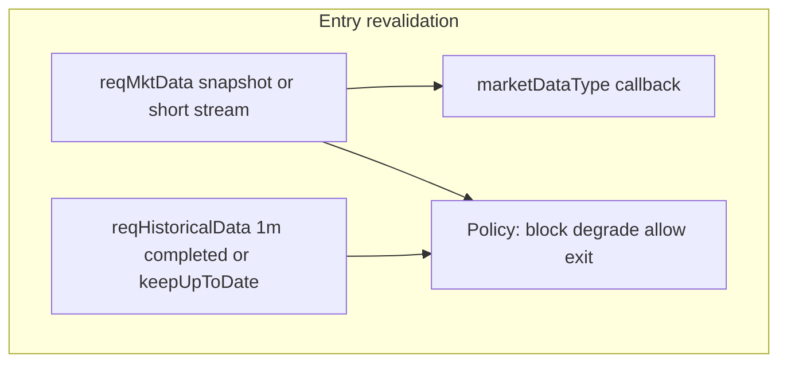

# Planning spec: delayed IB market-data path for MIP live decisioning

**Status:** Planning only — no production market-data redesign in this document.  
**Operating stance (2026-04):** Real-time IB market data is **not available** for this account for **~1 month** (subscription constraints). **Delayed 1m / historical-style bar context is expected** — treat live decisioning as **delayed-data mode**; **no further investigation** into IB delay root cause for this period — see [§12](#12-operating-stance-2026-04--delayed-data-period).  
**Does not contradict:** [17_ib_api_bar_path_and_market_data_mode.md](17_ib_api_bar_path_and_market_data_mode.md), [live_trade_diagnostic_phase4_memo.md](live_trade_diagnostic_phase4_memo.md), [18_strategy_shape_misalignment.sql](../SQL/scripts/live_trade_diagnostic/18_strategy_shape_misalignment.sql).  
**Track A (broker execution → `LIVE_ORDERS` → closeout)** remains authoritative for fills; this spec addresses **price/bar context** for entries only where noted.

---

## 1. Established findings (do not contradict)

| Finding | Source |
|---------|--------|
| Path: `live.py` → `_run_agent_ibkr_bar_refresh` → `fetch_ibkr_live_bars.py` → **`reqHistoricalData`** snapshot | `17` |
| No first-party **`reqMarketDataType()`** | `17`, Phase 4 |
| No **`keepUpToDate=True`** | `17` |
| Delayed / non-coincident 1m anchors supported by cohort SQL (`ONE_MIN_BAR_TS` vs broker entry) | Phase 4, `18` |
| **Guards** (`QUOTE_FRESHNESS_THRESHOLD_SEC`, `MAX_BAR_END_LAG_SEC`, exit bypass) reduce risk but **do not replace** knowing whether data is **live vs delayed** or whether the **last completed bar** is the right object for “current” context | `17`, `18` |

---

## 2. IBKR official API behavior (reference)

Use current IBKR documentation (Campus supersedes older tws-api pages; classic page still states the model):

- **Market data types (live / frozen / delayed / delayed frozen):** [Market Data Types (tws-api)](https://interactivebrokers.github.io/tws-api/market_data_type.html) — call **`reqMarketDataType`** before **`reqMktData`**; **`marketDataType` callback** reports the effective type for a request; **delayed is ~15–20 minutes** for free delayed US equities.
- **Historical bars + updates:** [Historical Bar Data (tws-api)](https://interactivebrokers.github.io/tws-api/historical_bars.html) — **`keepUpToDate=true`** continues **updating** bars via **`historicalDataUpdate`** after the initial history (per IB; `endDateTime` rules apply).
- **`reqMktData`:** normal **streaming** (and snapshot where supported) **top-of-book / last** path — distinct from **completed** OHLC bars.

**Implication:** A **one-shot `reqHistoricalData`** “latest 1m” is **not** the same contract as **“current market snapshot”**; it is **last completed bar** in whatever **market data type** IB applied for **historical** data (may align with delayed if not entitled).

---

## 3. Definitions (separate concerns)

| Concept | Meaning for MIP |
|--------|------------------|
| **Latest completed 1m bar** | OHLC for bar `[t, t+60s)` in exchange/session time; **inherently** lags “now” by up to ~60s even with **live** data. |
| **Current live price context** | Last trade / mid / bid-ask usable for **staleness vs wall clock** and **delay detection**; not the same as bar close. |
| **Delay class** | IB **`marketDataType`** (1 live, 3 delayed, …) + observed **lag** of bar end vs **now** (and vs **last tick time** if available). |

---

## 4. Option comparison (IB API paths)

| Option | What it gives | Pros | Cons / risks |
|--------|----------------|------|----------------|
| **`reqHistoricalData` snapshot** (current) | Last *completed* bars in window | Simple, already wired | May be **delayed**; **no** streaming update; **no** explicit type control in MIP today |
| **`reqHistoricalData(..., keepUpToDate=True)`** | Initial bars + **`historicalDataUpdate`** for **forming** bar | Closer to “live bar build”; IB-documented | Long-lived connection; lifecycle/cancel; must align `endDateTime` rules; still need **type** visibility |
| **`reqMktData`** (+ snapshot or short stream) | **Last / bid / ask**, **`marketDataType`** callback | Best for **“now”** and **delay detection** | Not a full OHLC bar; subscription/entitlement; more moving parts |
| **`realTimeBars`** | **5s** (or configured) streaming bars | High freshness | Different cadence than 1m; volume/aggregation differs from 1m committee context |
| **Hybrid** | e.g. **MktData** for *now* + **historical 1m** for *structure* | Separates **coincidence** from **bar shape** | Two requests; reconcile conflicts explicitly |

---

## 5. Recommendations (planning)

### 5.1 Production path for **live entry decisions** (answer required)

**Recommendation:** Use a **hybrid** for **entry revalidation / entry pricing**:

1. **Primary “current context”:** **`reqMktData`** (snapshot or bounded stream) to obtain **last** (and optionally bid/ask) and to receive **`marketDataType`** for that request.  
2. **Secondary “1m structure”:** Either  
   - **`reqHistoricalData` with `keepUpToDate=True`** for the **1m** series (so the **forming** bar updates), **or**  
   - keep **snapshot 1m** **only** for **completed** bar OHLC, but **never** treat it alone as “now.”

**Single clear sentence:** *MIP should not rely on a one-shot `reqHistoricalData` 1m snapshot as the sole source for “current” entry validation; it should use **`reqMktData`-derived last price (with `marketDataType`) plus an explicitly updating or clearly labeled completed 1m bar, and block or degrade when the effective type is delayed or lag exceeds policy.*

### 5.2 **Latest completed 1m bar** (reference / charts)

**Recommendation:** **`reqHistoricalData`** remains acceptable **if labeled “last completed bar”** and paired with **lag checks** vs **now** and vs **last tick**. Longer term, **`keepUpToDate=True`** on 1m is the cleaner IB-native way to **stream** bar updates for **chart-like** context (per IB docs).

### 5.3 **`reqMarketDataType()`**

**Yes — explicitly** in the **IB connect + fetch** layer (e.g. `fetch_ibkr_live_bars.py` or a shared IB session helper):

- **Where:** Immediately after **`ib.connect`**, before **`reqMktData`** / historical calls, call **`reqMarketDataType(1)`** to **request live** when product policy is “prefer live.”  
- **Detect / surface:** Rely on IB **`marketDataType` / `wrapper.marketDataType`** (ib_insync **`ticker.marketDataType`**) after **`reqMktData`**; **persist** on `LIVE_ACTIONS` revalidation payload (variant) or **return** in API **`reason_codes`** / diagnostics JSON.  
- **Do not** change TWS/Gateway **subscription purchases** in this phase — only **API request** of type; IB will still fall back per entitlements.

### 5.4 If **only delayed** data is available

**Policy (planning defaults — configurable per portfolio):**

| Mode | Entries | Exits | Read-only / charts |
|------|---------|-------|---------------------|
| **Strict** | **Block** or force **reduced size + explicit waiver** | **Allow** with **`DELAYED_DATA_CONTEXT`** reason (already aligned with exit bypass spirit) | Allowed with **watermark** |
| **Degrade** | **PASS_WITH_REDUCED_SIZE** + **`DELAYED_MARKET_DATA`** tag | Allow | Same |
| **Research** | Block live submit | N/A | Full |

**Separate entries vs exits:** **Yes** — keep **exit** path permissive; **tighten entry** when delayed or when **mkt lag** > threshold.

---

## 6. Smallest safe migration path (from current snapshot historical)

| Phase | Scope | Safety |
|-------|--------|--------|
| **0** | **Runtime verification** (this repo): run [verify_ibkr_1m_bar_lag.py](../../cursorfiles/verify_ibkr_1m_bar_lag.py) when IBG is up; log lag verdict | No behavior change |
| **1** | **Instrumentation only:** after connect, **`reqMarketDataType(1)`** + log; **`reqMktData`** snapshot for last; store **`marketDataType`**, **`last_tick_ts`**, **`fetched_at_utc`** next to bar JSON in revalidation audit | No blocking yet |
| **2** | **Entry gate:** if `marketDataType` in (3,4) or **last-vs-bar lag** > config → **block entry revalidation** or **degrade** per policy | Feature-flag per portfolio |
| **3** | **Optional:** `keepUpToDate=True` for 1m **or** replace “current” with **mkt data** entirely for price guard | Larger test surface |

**Note:** `fetch_ibkr_live_bars.py` had a **bug** where `_build_parser()` reused name `p` for **`ArgumentParser`**, breaking **`--port`** (default became invalid). **Fixed** so the **documented subprocess path** runs; MIP behavior unchanged aside from **working CLI defaults**.

**Important implementation detail:** `main()` enforces **`window_bars = max(15, …)`**, so **`--window-bars 1`** from `live.py` still fetches **15** bars; the **last** bar is the effective “latest 1m” — document and optionally align MIP comment vs script.

---

## 7. File / function impact map (future implementation)

| Area | Files |
|------|--------|
| IB connect / type / mkt data | [cursorfiles/fetch_ibkr_live_bars.py](../../cursorfiles/fetch_ibkr_live_bars.py), [live.py](../apps/mip_ui_api/app/routers/live.py) `_run_agent_ibkr_bar_refresh`, [ibkr_live_bars.py](../apps/mip_ui_api/app/services/ibkr_live_bars.py) |
| Revalidation merge logic | [live.py](../apps/mip_ui_api/app/routers/live.py) `revalidate_live_action` |
| Config | `LIVE_PORTFOLIO_CONFIG` — optional flags: `BLOCK_ENTRY_ON_DELAYED_DATA`, `MAX_LAST_VS_BAR_LAG_SEC` (planning names) |
| Persistence | `LIVE_ACTIONS` / `REASON_CODES` / param snapshot variant for **mkt data class** |

---

## 8. Target architecture (conceptual)



---

## 9. Validation plan

1. **Run** `verify_ibkr_1m_bar_lag.py` on **paper** and **live** entitlements; archive JSON + printed verdict.  
2. **Compare** `lag_now_minus_bar_end_sec` when **TWS shows live** vs **delayed** (brown UI).  
3. **Replay** `18` stmt 3 after instrumentation columns exist (future).  
4. **Regression:** exit revalidation still **never** stranded by bar-age guard.

---

## 10. Runtime verification — current 1m path (proof)

### 10.1 Exact reproduction (matches MIP subprocess)

From repo root (Windows):

```text
cursorfiles\.venv\Scripts\python.exe cursorfiles\fetch_ibkr_live_bars.py --symbols SPY --market-types STOCK --interval-minutes 1 --window-bars 1
```

Or wrapped analysis:

```text
cursorfiles\.venv\Scripts\python.exe cursorfiles\verify_ibkr_1m_bar_lag.py --symbols SPY
```

### 10.2 What to capture

| Field | Source |
|-------|--------|
| Request wall time (UTC) | Wrapper start/end around subprocess |
| `fetched_at_utc` | JSON payload |
| Last bar `ts`, O/H/L/C/V | JSON `symbols[0].bars[-1]` |
| IB market data type | Not available on **historical-only** path today; future: `reqMktData` + callback |

### 10.3 Run executed in Cursor agent environment (2026-04-14)

| Step | Result |
|------|--------|
| Command | Same argv as above (`SPY`, 1m, window 1 → **effective window 15** inside script) |
| `wrapper_request_utc_start` | `2026-04-14T15:49:29.0464160Z` |
| `wrapper_request_utc_end` | `2026-04-14T15:49:32.7710070Z` |
| IB connect | **Failed:** `ConnectionRefusedError` / WinError 1225 (no TWS/Gateway on configured host:port) |
| **LAG_VERDICT** | **NO_DATA** — **cannot** classify current vs delayed vs stale from this environment |

**Conclusion:** **Proof of delay magnitude requires a successful IB session** on your machine. The **code path** is confirmed; **latency class** is **unproven here** until you run **`verify_ibkr_1m_bar_lag.py`** with IBG running. If bar `ts` parses to UTC and **`lag_now_minus_bar_end_sec` ≥ ~900**, classify as **likely delayed (~15m)** per IB delayed definition; if **< 120s** after bar close, **current or near-live completed bar** is plausible.

**Timezone caveat:** IB bar `date` strings may be **exchange-local**. The verifier uses a **best-effort UTC parse**; if parsing fails, use TWS time zone or ib_insync `util` parsing in a follow-up **implementation** task.

---

## 11. Decision summary

| Question | Answer |
|----------|--------|
| IB path for **entry** validation? | **Hybrid: `reqMktData` (+ `marketDataType`) for “now”; 1m OHLC from historical completed and/or `keepUpToDate`** |
| IB path for **reference 1m bar**? | **Historical 1m** (completed) **or** **`keepUpToDate`** stream — **not** conflated with “now” |
| Call **`reqMarketDataType`?** | **Yes**, post-connect in fetch layer; **log/persist** effective type from **`reqMktData`** path |
| Delayed only? | **Entries:** block or degrade by policy; **exits:** allow with tags; **charts:** read-only OK |
| Smallest migration? | **Instrument (mkt type + last) → then gate entries**; optional **`keepUpToDate`** later |

**Production recommendation (one line):** *Use **`reqMktData` with explicit `reqMarketDataType` and `marketDataType` handling for entry decisions, and stop treating a standalone `reqHistoricalData` 1m snapshot as sufficient proof of “current” price — pair it with last-trade timing and delay-aware policy.*

---

## 12. Operating stance (2026-04) — delayed-data period

**Portfolio:** Paper. **Cause of delayed bars:** Interactive Brokers **real-time** market data is **unavailable for ~1 month** due to **account subscription constraints** (not a MIP socket/port bug). **Investigation closed** for this topic for the duration — no additional IB delay diagnostics required unless subscriptions change.

**Engineering priorities**

- **Continue Track A** — execution truth, broker reconciliation, `LIVE_ORDERS` / closeout propagation, and related fixes **without** blocking on restoring real-time intraday data.
- **Live 1m (and similar) decision context** — explicitly treat as **delayed-data mode**: staleness guards and policy remain relevant; do **not** assume bars coincide with “now.”

**Strategy and research (this period)**

- Do **not** assume **real-time intraday** bars for edge or timing claims.
- Favor **daily / next-session-compatible** logic, **pattern quality**, **horizon realism**, **bracket philosophy**, and **path-awareness** over intraday precision that depends on live ticks or fresh 1m closes.

When real-time entitlements return, revisit §5–§11 for optional **hybrid** (`reqMktData` + `marketDataType`) and entry policy tightening; until then, **delayed mode is the baseline**.

---

## 13. Phase 2 — Hold live-intraday logic (delayed-data mode)

**Context:** Real-time IB market data remains **unavailable for ~1 month** (subscription). The product stance is **delayed-data mode** for that period.

**Do**

- Keep **freshness guardrails** (`QUOTE_FRESHNESS_THRESHOLD_SEC`, `MAX_BAR_END_LAG_SEC`, exit bypass behavior) as implemented — they remain **risk controls**, not claims of real-time truth.
- Treat **1m (and other intraday) bar context** as **possibly delayed**; do **not** use it as sole proof of “current” price for **new** entry logic.
- Prioritize **Track A** execution truth ([execution_truth_reconcile_playbook.md](execution_truth_reconcile_playbook.md)) and **strategy-basis diagnostics** ([strategy_basis_diagnostic_memo.md](strategy_basis_diagnostic_memo.md)).

**Do not (this month)**

- **Optimize** live intraday **entry** behavior (bar cadence, `keepUpToDate`, hybrid `reqMktData` **production** wiring) **until** real-time entitlements return.
- **Judge MIP** as a **real-time intraday decision engine** during this window.

**Narrow exception:** Read-only **instrumentation** or operator diagnostics (e.g. lag scripts) are fine; **no** expanded entry policy or committee coupling to “fresh 1m” as a primary signal.
