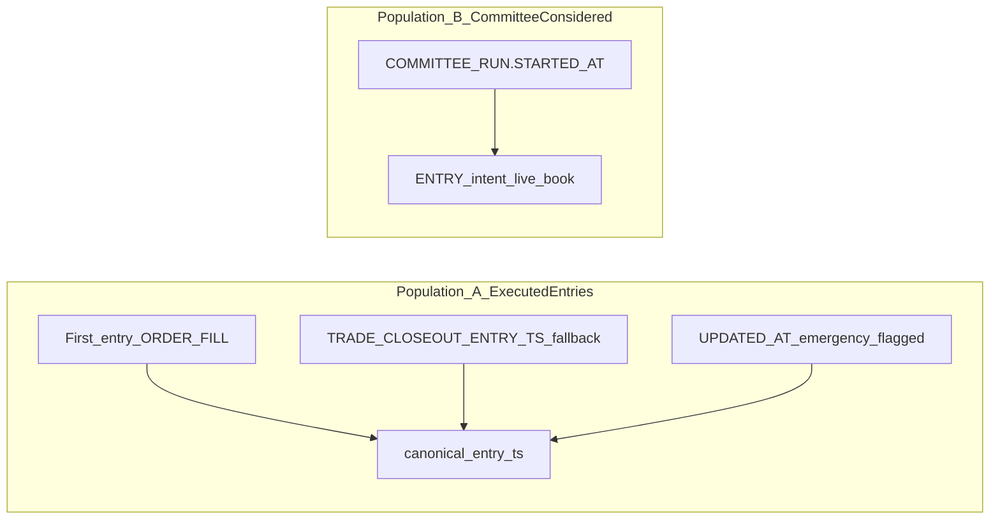
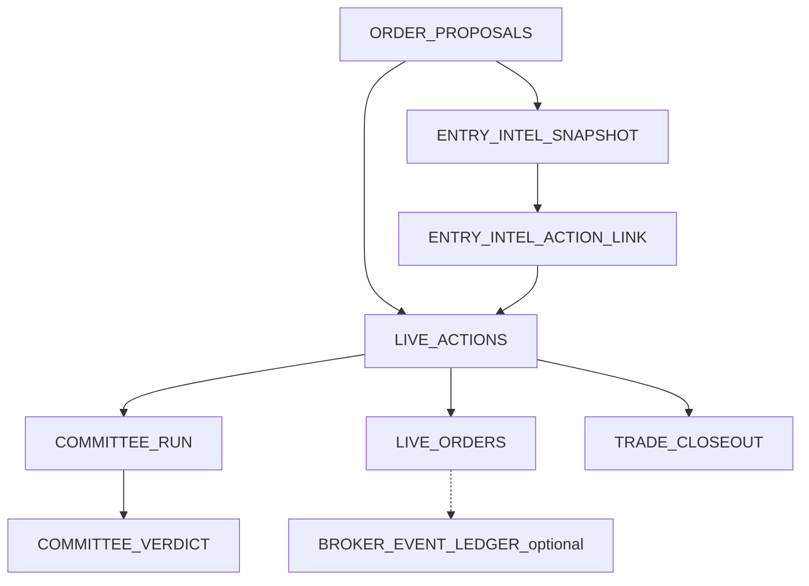

# Live trade diagnostic pack — architecture / join path

This note supports the read-only SQL under [`MIP/SQL/scripts/live_trade_diagnostic/`](../SQL/scripts/live_trade_diagnostic/). It records **verified** Snowflake object names and how layers join.

**Scripts:** `00_scope_and_trade_set.sql` … `08_chronological_trades.sql`, plus `live_trade_diagnostic_populations.sql` (comment-only CTE paste reference).

## Verified objects

| Area | Object |
|------|--------|
| Live config | `MIP.LIVE.LIVE_PORTFOLIO_CONFIG` (`ADAPTER_MODE = 'LIVE'` filter) |
| Actions / orders | `MIP.LIVE.LIVE_ACTIONS`, `MIP.LIVE.LIVE_ORDERS` |
| Closeouts | `MIP.LIVE.TRADE_CLOSEOUT` |
| Committee | `MIP.LIVE.COMMITTEE_RUN`, `MIP.LIVE.COMMITTEE_VERDICT`, `MIP.LIVE.COMMITTEE_ROLE_OUTPUT` |
| Proposals | `MIP.AGENT_OUT.ORDER_PROPOSALS` |
| EIS | `MIP.LIVE.ENTRY_INTEL_SNAPSHOT`, `MIP.LIVE.ENTRY_INTEL_ACTION_LINK` |
| Reconstruction view | `MIP.LIVE.V_ENTRY_INTEL_LIFECYCLE_RECONSTRUCTION` |
| Trade intelligence | `MIP.MART.V_TRADE_INTELLIGENCE` ([`v_trade_intelligence.sql`](../SQL/views/mart/v_trade_intelligence.sql)) |
| PW evidence (per action) | `MIP.APP.V_LIVE_ACTION_PARALLEL_WORLDS_EVIDENCE` (joins on `ACTION_ID`; not `MIP.MART.*`) |
| Market bars | `MIP.MART.MARKET_BARS` |
| Regime | `MIP.MART.V_MARKET_REGIME` |
| Training digest | `MIP.MART.V_TRAINING_DIGEST_SNAPSHOT_SYMBOL` |
| Trusted signals (current snapshot) | `MIP.MART.V_TRUSTED_SIGNALS_LATEST_TS` |
| Broker NAV | `MIP.LIVE.BROKER_SNAPSHOTS` (`SNAPSHOT_TYPE = 'NAV'`) |

## Two canonical populations (kept separate)

- **Population A — executed entries post-reset**  
  - Primary timestamp: first **non-protective** `LIVE_ORDERS` row per `ACTION_ID` (`IDEMPOTENCY_KEY` not matching `:(TP|SL)$`), `ACTION_INTENT` / `LIVE_ACTIONS` resolved to `ENTRY`, `FILLED_AT` ordered.  
  - **Fallback:** `TRADE_CLOSEOUT.ENTRY_TS` when no fill row.  
  - **Emergency only:** `LIVE_ACTIONS.UPDATED_AT` when both are null and action status is in an executed-ish set; `ENTRY_TS_SOURCE = 'EMERGENCY_ACTION_UPDATED_AT'`.

- **Population B — committee considered post-reset**  
  - `COMMITTEE_RUN.STARTED_AT >= 2026-04-07`, `ENTRY` intent, same live portfolio filter. Includes blocked / never-filled actions.

## End-to-end join path (proposal → closeout)

## Bracket / stop-target extraction precedence (scripts `05`, `07`)

1. `LIVE_ACTIONS.PARAM_SNAPSHOT:executable_bracket` (`target_return`, `stop_loss_pct`) unless `blocked = true`.  
2. `PARAM_SNAPSHOT:committee_bracket_baseline` (`realistic_target_return`, `acceptable_early_exit_target_return`, `stop_loss_pct`).  
3. Protective `LIVE_ORDERS` for the same `ACTION_ID`: `IDEMPOTENCY_KEY` suffix `TP`/`SL` and/or `ORDER_TYPE` hints; use `LIMIT_PRICE` as protective price.  
4. Else `NULL` with `BRACKET_EXTRACTION_FAILED` / `OTHER_OR_FAILED` flags in diagnostics.

## Price path / MFE / MAE

- **Interval precedence:** `INTERVAL_MINUTES = 5` if any bar exists in `[entry, exit]`; else **60** (`DIAG_PATH_INTRADAY_FALLBACK_MINUTES` in scripts); else **1440** (daily).  
- Output columns: `PATH_INTERVAL_USED`, `PATH_APPROXIMATION_LEVEL` (`INTRADAY_5M` | `INTRADAY_FALLBACK` | `DAILY`).  
- **MFE/MAE** use bar `HIGH`/`LOW` vs entry fill (Population A). Open trades use `path_end_ts = current_timestamp()`; partial path flagged in `02`.  
- **Approximation:** daily bars are lower resolution; missing intraday coverage forces daily fallback and widens uncertainty.

## Context joins (script `06`)

- **Regime:** `V_MARKET_REGIME.REGIME_DATE = canonical_entry_ts::date`.  
- **EIS:** `ENTRY_INTEL_ACTION_LINK` → `ENTRY_INTEL_SNAPSHOT`.  
- **Training digest:** `(SYMBOL, MARKET_TYPE, PATTERN_ID)` from proposal.  
- **PW evidence:** `V_LIVE_ACTION_PARALLEL_WORLDS_EVIDENCE` on `ACTION_ID` (portfolio-scoped payload; see view note).  
- **TIR:** `V_TRADE_INTELLIGENCE` on `ENTRY_ACTION_ID` (closeout grain).  
- **`V_TRUSTED_SIGNALS_LATEST_TS`:** current trusted snapshot; historical “at entry” trust is **not** replayed — join is labeled approximate in the memo.

## ENTRY_LAG_CLASS (scripts `07`, `08`)

- Anchor: `coalesce(ORDER_PROPOSALS.SIGNAL_TS, PROPOSED_AT)`.  
- Classes: `SAME_SIGNAL_DAY`, `NEXT_SESSION` (calendar `+1` day proxy), `LATER`, `UNKNOWN`.  
- **Limitation:** not a true exchange session calendar.

## Counterfactuals (Population B)

Blocked or non-filled actions do not have broker entry fills in scope. Scripts label **`COUNTERFACTUAL_UNAVAILABLE`** — do not infer P&amp;L for blocked proposals without explicit hypothetical entry rules.
