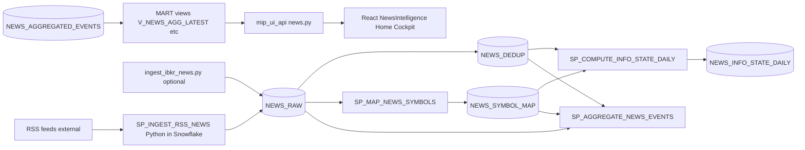

# MIP news stack — architecture note (diagnostic)

## End-to-end flow

Orchestrator: **`MIP.NEWS.SP_REFRESH_NEWS_CONTEXT`** ([379_sp_refresh_news_context.sql](../SQL/app/379_sp_refresh_news_context.sql)) calls ingest → seed subscriptions → map → `SP_COMPUTE_INFO_STATE_DAILY` → `SP_AGGREGATE_NEWS_EVENTS`, with **`MIP.APP.SP_LOG_EVENT`** rows under `EVENT_TYPE = 'NEWS_PIPELINE'`.

## Timestamp ladder (repo truth)

| Concept | Where |
|--------|--------|
| PUBLISHED_TS | `NEWS_RAW.PUBLISHED_AT` |
| INGESTED_TS | `NEWS_RAW.INGESTED_AT` |
| NORMALIZED_TS | **No column.** Ingest normalizes in Python; mapping timestamp proxied by `NEWS_SYMBOL_MAP.CREATED_AT` |
| SCORED_TS | `NEWS_AGGREGATED_EVENTS.SNAPSHOT_TS`, `NEWS_INFO_STATE_DAILY.SNAPSHOT_TS` |
| DISPLAYED_TS | **Not stored.** No user-visible audit table |

## Operational gates

1. **`NEWS_ENABLED`** (`APP_CONFIG`) — must be `true` for RSS ingest to run (unless test mode).
2. **`NEWS_COMMITTEE_WINDOW_ENFORCED`** — when `true`, `SP_REFRESH_NEWS_CONTEXT` **exits without work** outside defined **07:00–09:00 ET** slots (weekdays). Manual/API runs at other times return `SKIPPED_OUTSIDE_COMMITTEE_WINDOW`.
3. **Snowflake tasks** — repo DDL for `TASK_INGEST_RSS_NEWS` / `TASK_NEWS_PRECOMMITTEE_0900` ends with `alter task … suspend`, but **deployed environment must be verified with `show tasks in schema MIP.NEWS`**. As of diagnostic run, tasks were **`started`** and **`TASK_INGEST_RSS_NEWS` / `TASK_NEWS_PRECOMMITTEE_0900` succeeded** on 2026-04-06–08.
4. **`TASK_COMPUTE_NEWS_INFO_STATE_DAILY`** — separate cron (`16:00` ET weekdays per `show tasks`); runs **`SP_COMPUTE_INFO_STATE_DAILY` only**, not full refresh.

## Active / legacy / uncertain

| Object / path | Classification | Notes |
|---------------|----------------|-------|
| `SP_INGEST_RSS_NEWS` | **Active** | Primary RSS path into `NEWS_RAW` |
| `SP_REFRESH_NEWS_CONTEXT` | **Active** | Committee-window full chain |
| `ingest_ibkr_news.py` + `live.py` IBKR refresh | **Active code, data uncertain** | `IBKR_NEWS_API` registered; **no `NEWS_RAW` rows** for that `SOURCE_ID` in sampled DB |
| `TASK_NEWS_TUESDAY_CATCHUP` | **Legacy removed** | Dropped in [380_task_news_tuesday_catchup.sql](../SQL/app/380_task_news_tuesday_catchup.sql) |
| `NEWS_SOURCES` list (SEC_RSS_INDEX, etc.) | **Partial mismatch** | Config JSON lists sources; **`SEC_RSS_INDEX` not present** in `NEWS_RAW` distinct `SOURCE_ID` set (only 8 IDs observed) |
| Ticker RSS (Yahoo, Seeking Alpha, Nasdaq) | **Stale feeds** | Last ingest **2026-03-10** in environment sampled |
| `V_NEWS_FEED_HEALTH` | **Active, narrow** | Only **07:00–09:30 ET sameday** ingest; misleading if read as 24h health |
| Morning brief `MORNING_BRIEF` | **Active, no news section** | Top-level keys: `as_of_ts`, `attribution`, `pipeline_run_id`, `portfolio`, `proposals`, `risk`, `signals` — **no `news` key**; `contains(...,'news')` over JSON **0** in 30d sample |

## Key tables / views

- `MIP.NEWS.NEWS_RAW`, `NEWS_SYMBOL_MAP`, `NEWS_DEDUP`, `NEWS_INFO_STATE_DAILY`, `NEWS_AGGREGATED_EVENTS`
- `MIP.MART.V_NEWS_AGG_LATEST` — API primary read for `/news/intelligence`
- `MIP.MART.V_NEWS_FEED_HEALTH` — committee-slot monitor
- `MIP.MART.V_NEWS_FEATURES_BY_TS` — `/news/intelligence/overview` headline sentiment overlay

## Dedupe contract

- Row-level `DEDUP_CLUSTER_ID` = hash of **canonical URL** (see [373_sp_ingest_rss_news.sql](../SQL/app/373_sp_ingest_rss_news.sql)). **Not** title/event clustering.
- `NEWS_DEDUP` aggregates **all** rows sharing `DEDUP_CLUSTER_ID`; large `CLUSTER_SIZE` values indicate **same URL seen many times** (re-ingest), not “same story different URL.”

## Proposal coupling

- [188_sp_agent_propose_trades.sql](../SQL/app/188_sp_agent_propose_trades.sql) consumes news features / badges / conflict proxies for scoring and guardrails.
- [live.py](../../apps/mip_ui_api/app/routers/live.py) applies committee caution from `NEWS_CONTEXT_SNAPSHOT` on actions.
