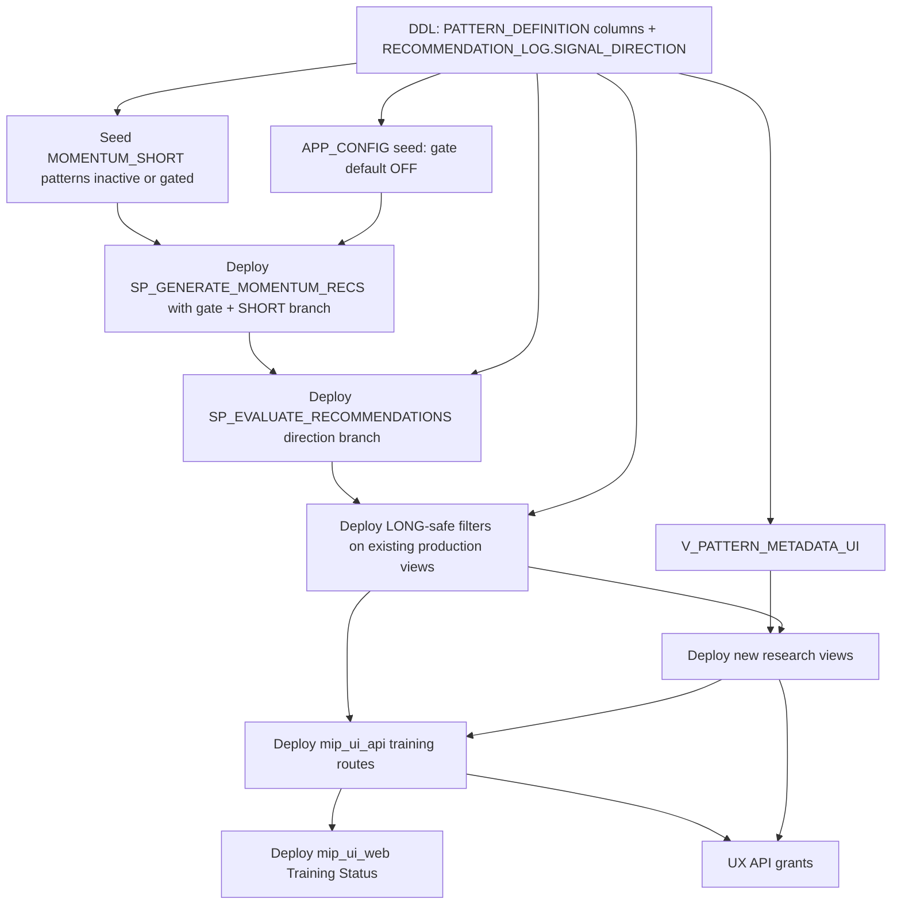

# Short Momentum Foundation — Implementation Package

Execution-oriented checklist derived from the approved plan (`short_momentum_diagnostic_66ec6324.plan.md` / Short Momentum Foundation). **No code here** — object names, file paths, sequencing, and contracts only.

---

## 1. Final object / file change list

### 1.1 Tables (DDL)

| Action | Object | File (expected) |
|--------|--------|-----------------|
| **Modify** | `MIP.APP.RECOMMENDATION_LOG` — add `SIGNAL_DIRECTION` (`VARCHAR`, nullable; values `LONG` / `SHORT`) | [`MIP/SQL/app/050_app_core_tables.sql`](MIP/SQL/app/050_app_core_tables.sql) **and/or** new file under [`MIP/SQL/migrations/`](MIP/SQL/migrations/) |
| **Modify** | `MIP.APP.PATTERN_DEFINITION` — add canonical metadata columns (see §4) | Same pattern as above |
| **Modify** | `MIP.APP.APP_CONFIG` — **rows only** (no DDL): insert seed for config key(s) (see §3) | New seed script under [`MIP/SQL/scripts/`](MIP/SQL/scripts/) or existing config seed |

`MIP.APP.RECOMMENDATION_OUTCOMES` — **no new columns** this phase; continue populating existing `DIRECTION` from evaluation logic.

### 1.2 Stored procedures

| Action | Object | File |
|--------|--------|------|
| **Modify** | `MIP.APP.SP_GENERATE_MOMENTUM_RECS` | [`MIP/SQL/app/070_sp_generate_momentum_recs.sql`](MIP/SQL/app/070_sp_generate_momentum_recs.sql) |
| **Modify** | `MIP.APP.SP_EVALUATE_RECOMMENDATIONS` | [`MIP/SQL/app/105_sp_evaluate_recommendations.sql`](MIP/SQL/app/105_sp_evaluate_recommendations.sql) |

**No changes** to proposal, committee, PW, or live execution procs per scope (e.g. do **not** modify [`188_sp_agent_propose_trades.sql`](MIP/SQL/app/188_sp_agent_propose_trades.sql), [`189_sp_validate_and_execute_proposals.sql`](MIP/SQL/app/189_sp_validate_and_execute_proposals.sql), [`235_sp_run_parallel_worlds.sql`](MIP/SQL/app/235_sp_run_parallel_worlds.sql), [`170_sp_simulate_portfolio.sql`](MIP/SQL/app/170_sp_simulate_portfolio.sql) except if a **read-path filter** is required inside PW SQL — prefer **view/filter** on underlying data so proc body stays untouched; see §5).

### 1.3 Views — **modify** (LONG-safe filters / join to log direction)

Deploy in dependency order (see §2). Minimum set that **must** be proven LONG-safe if `SHORT` rows can exist in `RECOMMENDATION_LOG` / `RECOMMENDATION_OUTCOMES`:

| Object | File |
|--------|------|
| `MIP.MART.V_SIGNAL_OUTCOMES_BASE` | [`MIP/SQL/mart/035_mart_training_views.sql`](MIP/SQL/mart/035_mart_training_views.sql) |
| `MIP.MART.V_TRAINING_KPIS` | Same |
| `MIP.MART.V_TRAINING_LEADERBOARD` | Same |
| `MIP.MART.V_SIGNAL_OUTCOME_KPIS` | [`MIP/SQL/views/mart/v_signal_outcome_kpis.sql`](MIP/SQL/views/mart/v_signal_outcome_kpis.sql) |
| `MIP.MART.V_TRUSTED_SIGNAL_POLICY` | [`MIP/SQL/views/mart/v_trusted_signal_policy.sql`](MIP/SQL/views/mart/v_trusted_signal_policy.sql) |
| `MIP.MART.V_TRUSTED_PATTERN_HORIZONS` | [`MIP/SQL/mart/036_mart_trusted_gate_views.sql`](MIP/SQL/mart/036_mart_trusted_gate_views.sql) |
| `MIP.MART.V_TRUSTED_SIGNALS_LATEST_TS` | Same |
| `MIP.MART.V_TRUSTED_TOP10` | Same |
| `MIP.MART.V_SIGNALS_LATEST_TS` | Same |
| `MIP.MART.V_TRAINING_DIGEST_SNAPSHOT_SYMBOL` | [`MIP/SQL/views/mart/v_training_digest_snapshot_symbol.sql`](MIP/SQL/views/mart/v_training_digest_snapshot_symbol.sql) |
| `MIP.MART.V_TRAINING_DIGEST_SNAPSHOT_GLOBAL` | [`MIP/SQL/views/mart/v_training_digest_snapshot_global.sql`](MIP/SQL/views/mart/v_training_digest_snapshot_global.sql) |
| `MIP.MART.V_SYMBOL_TRAINING_READINESS` | [`MIP/SQL/views/mart/v_symbol_training_readiness.sql`](MIP/SQL/views/mart/v_symbol_training_readiness.sql) |
| `MIP.APP.V_TRUSTED_SIGNAL_CLASSIFICATION` | [`MIP/SQL/app/164_trusted_signal_classification.sql`](MIP/SQL/app/164_trusted_signal_classification.sql) |
| `MIP.APP.V_SIGNALS_ELIGIBLE_TODAY` | [`MIP/SQL/app/165_signals_eligible_today.sql`](MIP/SQL/app/165_signals_eligible_today.sql) |
| `MIP.MART.REC_OUTCOME_COVERAGE` | [`MIP/SQL/mart/030_mart_rec_outcome_views.sql`](MIP/SQL/mart/030_mart_rec_outcome_views.sql) |
| `MIP.MART.REC_OUTCOME_PERF` | Same |
| `MIP.MART.REC_PATTERN_TRUST_RANKING` | Same |
| `MIP.MART.V_TRUSTED_SIGNALS` | Same |
| `MIP.MART.V_PORTFOLIO_SIGNALS` | Same |
| `MIP.MART.SCORE_CALIBRATION` | Same |
| `MIP.MART.V_SIGNALS_WITH_EXPECTED_RETURN` | Same |
| `MIP.MART.REC_TRAINING_KPIS` | [`MIP/SQL/mart/020_mart_rec_training_kpis.sql`](MIP/SQL/mart/020_mart_rec_training_kpis.sql) |
| `MIP.MART.V_PORTFOLIO_ATTRIBUTION` | [`MIP/SQL/views/mart/v_portfolio_attribution.sql`](MIP/SQL/views/mart/v_portfolio_attribution.sql) |
| `MIP.MART.V_SCORE_CALIBRATION` | [`MIP/SQL/views/mart/v_score_calibration.sql`](MIP/SQL/views/mart/v_score_calibration.sql) |
| `MIP.MART.V_AGENT_DAILY_SIGNAL_BRIEF` | [`MIP/SQL/views/mart/v_agent_daily_signal_brief.sql`](MIP/SQL/views/mart/v_agent_daily_signal_brief.sql) |
| `MIP.APP.V_RECOMMENDATION_QUALITY_SCORE` (if path touches outcomes/log) | [`MIP/SQL/views/app/v_recommendation_quality_score.sql`](MIP/SQL/views/app/v_recommendation_quality_score.sql) |

**Intraday mart views** that join `RECOMMENDATION_LOG` / `RECOMMENDATION_OUTCOMES` — apply same LONG-safe rule if SHORT daily rows could theoretically appear in shared tables (defensive): e.g. [`v_intraday_outcomes_fee_adjusted.sql`](MIP/SQL/views/mart/v_intraday_outcomes_fee_adjusted.sql), [`v_intraday_trusted_signals.sql`](MIP/SQL/views/mart/v_intraday_trusted_signals.sql), [`v_intraday_signals_latest_ts.sql`](MIP/SQL/views/mart/v_intraday_signals_latest_ts.sql).

### 1.4 Views — **create** (research layer)

| New object (proposed names; adjust to repo naming) | Purpose |
|----------------------------------------------------|---------|
| `MIP.MART.V_PATTERN_METADATA_UI` | Single read model for API/UI: canonical pattern fields (§4) |
| `MIP.MART.V_SIGNAL_OUTCOMES_BASE_RESEARCH` | `RECOMMENDATION_LOG` ⋈ `RECOMMENDATION_OUTCOMES`, **all** `SIGNAL_DIRECTION` values; strategy returns |
| `MIP.MART.V_TRAINING_KPIS_RESEARCH` | KPIs grouped with `SIGNAL_DIRECTION` (and existing horizon keys) |
| `MIP.MART.V_TRAINING_LEADERBOARD_RESEARCH` | Optional thin wrapper on research KPIs with same `N_SUCCESS` cutoff semantics as leaderboard unless spec says otherwise |
| `MIP.MART.V_SHORT_RESEARCH_EVIDENCE_STAGE` (or similar) | Lightweight classification for SHORT rows only (counts / coarse stage) for Training Status — **not** production trust |

New SQL file suggestion: `MIP/SQL/mart/037_mart_short_momentum_research_views.sql` (or `views/mart/` split — one deploy unit).

### 1.5 Seed / pattern data

| Action | Artifact |
|--------|----------|
| **Create** | Seed script: new `PATTERN_DEFINITION` rows for **SHORT** momentum (distinct `NAME`, `PATTERN_ID`, `PATTERN_TYPE = 'MOMENTUM_SHORT'`, params, `IS_ACTIVE` / `ENABLED` per rollout) | e.g. [`MIP/SQL/scripts/`](MIP/SQL/scripts/) `seed_short_momentum_patterns.sql` |

**Compatibility note:** Existing rows use `PATTERN_TYPE` default **`MOMENTUM`** per [`300_intraday_tables.sql`](MIP/SQL/app/300_intraday_tables.sql). This phase **does not** require renaming `MOMENTUM` → `MOMENTUM_LONG` (avoids touching [`364_sp_bootstrap_generate_recommendations_cohort.sql`](MIP/SQL/app/364_sp_bootstrap_generate_recommendations_cohort.sql), [`v_recommendation_quality_score.sql`](MIP/SQL/views/app/v_recommendation_quality_score.sql), proposal policy seeds). Metadata view treats **`MOMENTUM`** as **LONG** family (§4).

### 1.6 API (Python)

| Action | File |
|--------|------|
| **Modify** | [`MIP/apps/mip_ui_api/app/routers/training.py`](MIP/apps/mip_ui_api/app/routers/training.py) — `/training/status` SQL, `/training/timeline` params |
| **Modify** | [`MIP/apps/mip_ui_api/app/training_timeline.py`](MIP/apps/mip_ui_api/app/training_timeline.py) — timeline SQL + `signal_direction` |
| **Modify** (if row shape / keys change) | [`MIP/apps/mip_ui_api/app/training_status.py`](MIP/apps/mip_ui_api/app/training_status.py) — only if scoring keys need direction passthrough |
| **Modify** | Tests: [`MIP/apps/mip_ui_api/tests/test_training_status_scoring.py`](MIP/apps/mip_ui_api/tests/test_training_status_scoring.py), [`MIP/apps/mip_ui_api/tests/smoke_training_status.py`](MIP/apps/mip_ui_api/tests/smoke_training_status.py) |

### 1.7 UI (React)

| Action | File |
|--------|------|
| **Modify** | [`MIP/apps/mip_ui_web/src/pages/TrainingStatus.jsx`](MIP/apps/mip_ui_web/src/pages/TrainingStatus.jsx) — row key, pattern column, direction badge |
| **Modify** | [`MIP/apps/mip_ui_web/src/components/TrainingTimelineInline.jsx`](MIP/apps/mip_ui_web/src/components/TrainingTimelineInline.jsx) — timeline query params, chart copy |
| **Modify** (optional) | [`MIP/apps/mip_ui_web/src/pages/TrainingStatus.css`](MIP/apps/mip_ui_web/src/pages/TrainingStatus.css), [`TrainingTimelineInline.css`](MIP/apps/mip_ui_web/src/components/TrainingTimelineInline.css) |
| **Modify** (optional) | Glossary / guide: [`MIP/apps/mip_ui_web/src/guide/15-training-status.md`](MIP/apps/mip_ui_web/src/guide/15-training-status.md) |

### 1.8 Grants / deploy

| Action | File |
|--------|------|
| **Modify** | [`MIP/SQL/deploy/ux_api_user/02_grants_readonly.sql`](MIP/SQL/deploy/ux_api_user/02_grants_readonly.sql) — `SELECT` on `V_PATTERN_METADATA_UI` and any new mart views the API queries |

### 1.9 Procs — **direct LONG filter (required)**

Per §5.2, these procs read shared tables **directly** — **not** optional. Add **`SIGNAL_DIRECTION IS NULL OR SIGNAL_DIRECTION = 'LONG'`** on every `RECOMMENDATION_LOG` reference.

| Object | File |
|--------|------|
| `MIP.APP.SP_RUN_PARALLEL_WORLDS` | [`235_sp_run_parallel_worlds.sql`](MIP/SQL/app/235_sp_run_parallel_worlds.sql) |
| `MIP.APP.SP_EVALUATE_EARLY_EXITS` | [`345_sp_evaluate_early_exits.sql`](MIP/SQL/app/345_sp_evaluate_early_exits.sql) |
| `MIP.APP.SP_TRAIN_NEWS_CALIBRATION` | [`386_sp_train_news_calibration.sql`](MIP/SQL/app/386_sp_train_news_calibration.sql) |
| `MIP.APP.SP_BOOTSTRAP_EVALUATE_RECOMMENDATIONS_COHORT` | [`365_sp_bootstrap_evaluate_recommendations_cohort.sql`](MIP/SQL/app/365_sp_bootstrap_evaluate_recommendations_cohort.sql) |

---

## 2. Migration order

**Dependency notes**

1. **DDL first** — `SIGNAL_DIRECTION` and pattern columns must exist before any proc/view references them.
2. **Config seed** before relying on gate in `SP_GENERATE_MOMENTUM_RECS` (proc should read missing key as OFF).
3. **`V_PATTERN_METADATA_UI`** before API/UI assume enriched labels (API can fall back temporarily but contract wants one source).
4. **`SP_EVALUATE_RECOMMENDATIONS`** before research views that assume strategy returns for SHORT (or deploy views after eval).
5. **LONG-safe filters on existing views** before or immediately when SHORT rows could exist — **same release as** eval + gen enable, or **before** turning gate ON.
6. **Research views** after base tables + eval semantics are deployed.
7. **API/UI** after DB objects exist; **grants** before API smoke in deployed env.

---

## 3. Config gate design

### 3.1 Key(s)

| Key | Type | Default | Interpretation |
|-----|------|---------|----------------|
| `SHORT_MOMENTUM_GENERATION_ENABLED` | string (`true`/`false` or `1`/`0`) | **`false`** | Master switch read by `SP_GENERATE_MOMENTUM_RECS` |

Optional second key (if you want ops visibility without code change):

| Key | Default | Purpose |
|-----|---------|---------|
| `SHORT_MOMENTUM_PATTERN_TYPES` | `MOMENTUM_SHORT` | Comma-separated list of `PATTERN_TYPE` values treated as SHORT momentum for generation eligibility when master switch is ON |

### 3.2 Gate behavior

| State | Behavior |
|-------|----------|
| **OFF** (missing, `false`, `0`, empty) | Procedure **never** inserts `SIGNAL_DIRECTION = 'SHORT'` rows. SHORT patterns may exist but are skipped for momentum generation loop (or treated like disabled for SHORT branch only). **LONG** patterns unchanged. |
| **ON** | Procedure **may** run SHORT logic for patterns whose metadata qualifies (see below). |

### 3.3 Activation composition

**Both** must hold for a SHORT insert to occur:

1. `SHORT_MOMENTUM_GENERATION_ENABLED` is ON.
2. Pattern row: `IS_ACTIVE = 'Y'`, `ENABLED = true`, and `PATTERN_TYPE` in the configured SHORT set (default **`MOMENTUM_SHORT`**).

This matches the plan: global kill switch + normal pattern lifecycle controls rollout and A/B.

---

## 4. Metadata source design

### 4.1 Canonical source: `MIP.APP.PATTERN_DEFINITION`

Add **physical columns** (preferred for single source of truth; avoid UI-only JSON scraping):

| Column | Type | Notes |
|--------|------|-------|
| `PATTERN_FAMILY` | `VARCHAR` | e.g. `MOMENTUM`, `MEAN_REVERSION` |
| `SIGNAL_DIRECTION` | `VARCHAR` | `LONG` \| `SHORT` — pattern default / UX; **per-signal** direction still comes from `RECOMMENDATION_LOG.SIGNAL_DIRECTION` |
| `DISPLAY_NAME` | `VARCHAR` | Full label |
| `DISPLAY_SHORT_NAME` | `VARCHAR` | Compact label |
| `PARAM_FAST` | `NUMBER` (nullable) | Optional; sync from `PARAMS_JSON` at seed/migration |
| `PARAM_SLOW` | `NUMBER` (nullable) | Optional |
| `PARAM_HORIZON` | `VARCHAR` or `NUMBER` (nullable) | Optional; e.g. horizon label for UI |

Existing columns remain authoritative for **detection** behavior: `PARAMS_JSON`, `PATTERN_TYPE`, `NAME`, `IS_ACTIVE`, `ENABLED`.

**Legacy rows:** `PATTERN_FAMILY` / `DISPLAY_*` / pattern-level `SIGNAL_DIRECTION` may be **NULL**; view applies defaults (§4.3).

### 4.2 Metadata view name

**`MIP.MART.V_PATTERN_METADATA_UI`**

### 4.3 Fields exposed to API/UI (view output)

| Output column | Source / rule |
|---------------|---------------|
| `PATTERN_ID` | `PATTERN_DEFINITION.PATTERN_ID` |
| `PATTERN_TYPE` | `PATTERN_DEFINITION.PATTERN_TYPE` |
| `PATTERN_FAMILY` | Column or derived from type |
| `SIGNAL_DIRECTION` | Column or **`CASE WHEN PATTERN_TYPE = 'MOMENTUM_SHORT' THEN 'SHORT' WHEN PATTERN_TYPE = 'MOMENTUM' THEN 'LONG' ELSE coalesce(column,'LONG') END`** |
| `DISPLAY_NAME` | Column or fallback from `NAME` |
| `DISPLAY_SHORT_NAME` | Column or truncated `DISPLAY_NAME` |
| `PARAM_SUMMARY` | Built from `PARAM_FAST` / `PARAM_SLOW` / `PARAM_HORIZON` or formatted extract from `PARAMS_JSON` **in this view only** |

---

## 5. LONG-safe protection plan

**Authoritative rule (required):** Every protected consumer must restrict rows using **`RECOMMENDATION_LOG.SIGNAL_DIRECTION IS NULL OR RECOMMENDATION_LOG.SIGNAL_DIRECTION = 'LONG'`** (via join or subquery on `RECOMMENDATION_ID`). **`RECOMMENDATION_OUTCOMES.DIRECTION` alone is not sufficient** — outcomes can exist for SHORT recs; filtering only on outcomes would miss rows or allow inconsistent joins. Apply the log-based predicate anywhere `RECOMMENDATION_OUTCOMES` is used without an existing log join.

**Defense in depth (optional):** `PATTERN_TYPE = 'MOMENTUM_SHORT'` exclusion on `PATTERN_DEFINITION` — **supplement only**; log direction remains authoritative.

### 5.1 `MOMENTUM_SHORT` / `PATTERN_TYPE` — production and decisioning surfaces

Relying on “`MOMENTUM_SHORT` never reaches trusted leaderboard” is **not** sufficient: raw `RECOMMENDATION_LOG` drives many surfaces. **Explicit log-direction filter** is required below. **PATTERN_TYPE borrow** in `V_TRUSTED_SIGNALS_LATEST_TS` does not add SHORT to trusted horizons if leaderboard is LONG-only, but **candidate signals** could still be SHORT unless `r` is filtered.

| Object | Already safe today? | `MOMENTUM_SHORT` / SHORT rows after launch | Protection method |
|--------|---------------------|---------------------------------------------|-------------------|
| `MIP.MART.V_TRUSTED_SIGNALS_LATEST_TS` | N/A (no SHORT yet) | **Needs** filter on `r` in `candidates` CTE | `r.SIGNAL_DIRECTION IS NULL OR r.SIGNAL_DIRECTION = 'LONG'` |
| `MIP.MART.V_SIGNALS_LATEST_TS` | Same | **Needs** same on `r` | Log-direction filter |
| `MIP.APP.V_SIGNALS_ELIGIBLE_TODAY` | Same | **Needs** filter in `recs` CTE on `r` | Log-direction filter |
| `MIP.MART.V_TRUSTED_PATTERN_HORIZONS` / `V_TRUSTED_TOP10` | Same | Safe **if** `V_TRAINING_LEADERBOARD` is LONG-only | LONG-safe `V_TRAINING_KPIS` upstream |
| `MIP.MART.V_TRUSTED_SIGNAL_POLICY` | Same | Safe **if** `V_SIGNAL_OUTCOME_KPIS` LONG-only | Filter in KPI view |
| `MIP.MART.V_TRAINING_DIGEST_SNAPSHOT_SYMBOL` / `_GLOBAL` | Same | **Needs** filter on all log arms | Log-direction filter |
| `MIP.APP.V_TRUSTED_SIGNAL_CLASSIFICATION` | Same | **Needs** filter in `recs` CTE | Log-direction filter |
| `MIP.MART.V_PORTFOLIO_SIGNALS` | Same | **Needs** filter on `rl` | Log-direction filter |
| `MIP.MART.V_SIGNAL_OUTCOME_KPIS` | Same | **Needs** join log + filter | Log-direction filter |
| `MIP.APP.SP_AGENT_PROPOSE_TRADES` | N/A | **No proc edit** per scope — protected **only if** `V_TRUSTED_SIGNALS_LATEST_TS` (and any other inputs) are LONG-filtered | Upstream views |
| `MIP.APP.V_RECOMMENDATION_QUALITY_SCORE` | Same | **Audit** — branches on `PATTERN_TYPE`; add log join + filter if base includes SHORT recs | Log-direction filter on `r` |

Per-object strategy (LONG-safe via log):

| Object / area | Strategy |
|---------------|----------|
| `V_SIGNAL_OUTCOMES_BASE` → `V_TRAINING_KPIS` / `V_TRAINING_LEADERBOARD` | Join log; LONG-only filter on `SIGNAL_DIRECTION` |
| `V_SIGNAL_OUTCOME_KPIS` | Join log; LONG-only filter |
| `V_TRUSTED_SIGNAL_POLICY` | Underlying KPIs LONG-only — filter in `V_SIGNAL_OUTCOME_KPIS` or in policy CTE sources |
| `V_TRUSTED_PATTERN_HORIZONS`, `V_TRUSTED_TOP10` | Driven by leaderboard — ensure leaderboard LONG-safe |
| `V_TRUSTED_SIGNALS_LATEST_TS`, `V_SIGNALS_LATEST_TS` | Join `RECOMMENDATION_LOG`; exclude `SIGNAL_DIRECTION = 'SHORT'` |
| `V_TRAINING_DIGEST_SNAPSHOT_*` | All rec/outcome CTEs: join log; LONG-only |
| `V_SYMBOL_TRAINING_READINESS` | `outcome_stats` / classification CTEs: restrict to LONG-only log rows (and/or exclude `MOMENTUM_SHORT` patterns) |
| `V_TRUSTED_SIGNAL_CLASSIFICATION` | Restrict `recs` CTE to LONG-only log rows |
| `REC_OUTCOME_*`, `V_TRUSTED_SIGNALS`, `V_PORTFOLIO_SIGNALS`, `SCORE_CALIBRATION`, `V_SIGNALS_WITH_EXPECTED_RETURN`, `REC_TRAINING_KPIS` | Join log; LONG-only |
| `V_PORTFOLIO_ATTRIBUTION`, `V_SCORE_CALIBRATION`, `V_AGENT_DAILY_SIGNAL_BRIEF` | Join log; LONG-only |
| `SP_RUN_PARALLEL_WORLDS` / `SP_EVALUATE_EARLY_EXITS` / `SP_TRAIN_NEWS_CALIBRATION` / `SP_BOOTSTRAP_EVALUATE_RECOMMENDATIONS_COHORT` | **Direct change required** — each reads `RECOMMENDATION_LOG` / `RECOMMENDATION_OUTCOMES` **directly**, not via LONG-safe mart views (see §5.2) |

**Preserve:** Object names and consumer contracts for production paths; **only** narrow row sets.

### 5.2 Shared-table procs — not safe via views alone

These procedures **join `MIP.APP.RECOMMENDATION_LOG` and/or `MIP.APP.RECOMMENDATION_OUTCOMES` directly**. LONG-safe mart views **do not** wrap those joins. **Each proc requires** the same log predicate on every `RECOMMENDATION_LOG` alias: **`SIGNAL_DIRECTION IS NULL OR SIGNAL_DIRECTION = 'LONG'`** (and on correlated subqueries that scan the log).

| Procedure | Upstream view sufficient? | Action |
|-----------|-------------------------|--------|
| `MIP.APP.SP_RUN_PARALLEL_WORLDS` | **No** — multiple subqueries on `RECOMMENDATION_LOG` + outcomes without going through filtered views | **Direct filter** on each `rl` / `rl2` arm |
| `MIP.APP.SP_EVALUATE_EARLY_EXITS` | **No** — uses `RECOMMENDATION_LOG` and outcomes; joins `V_PORTFOLIO_SIGNALS` / `V_TRUSTED_SIGNALS` but hold-to-end block uses raw `rl` | **Direct filter** on `rl` / `rl2` in that block; **and** LONG-safe `V_PORTFOLIO_SIGNALS` |
| `MIP.APP.SP_TRAIN_NEWS_CALIBRATION` | **No** — `JOIN RECOMMENDATION_LOG r` already present | **Direct filter** on `r` |
| `MIP.APP.SP_BOOTSTRAP_EVALUATE_RECOMMENDATIONS_COHORT` | **No** — `JOIN RECOMMENDATION_LOG r` | **Direct filter** on `r` |

---

## 6. Research-layer object plan

| Object | Role | Consumers |
|--------|------|-----------|
| `V_PATTERN_METADATA_UI` | Labels + family + param summary | `GET /training/status`, `GET /training/timeline` (join), future research pages |
| `V_SIGNAL_OUTCOMES_BASE_RESEARCH` | Full signal+outcome base for analysis | Optional internal SQL, future dashboards; **not** wired into production trust |
| `V_TRAINING_KPIS_RESEARCH` | Direction-aware KPIs | Training Status **optional** second query or combined API SQL; documentation for analysts |
| `V_TRAINING_LEADERBOARD_RESEARCH` | Research leaderboard | Same |
| `V_SHORT_RESEARCH_EVIDENCE_STAGE` | Coarse SHORT-only stage for UI badge | Training Status for rows with `signal_direction = 'SHORT'` only |

**Explicit non-goals:** No wiring of these into `V_TRUSTED_SIGNALS_LATEST_TS`, proposal agents, or committee SQL.

**API:** `/training/status` may use **inline SQL** that `GROUP BY` includes `signal_direction` and **LEFT JOIN** `V_PATTERN_METADATA_UI` — acceptable if research views are not strictly required for v1; research views still recommended for consistency and analyst reuse.

---

## 7. Training Status contract

### 7.1 Row identity (canonical)

Unique key for a training row:

1. `market_type`
2. `symbol`
3. `pattern_id`
4. `interval_minutes`
5. `signal_direction` — values `LONG` \| `SHORT`; for legacy data use **`LONG`** when `SIGNAL_DIRECTION IS NULL` at response serialization time **or** expose `null` only if UI coalesces to LONG (prefer explicit `LONG` in JSON for clarity).

### 7.2 API response changes (`GET /training/status`)

Each row **must** include:

- Identity fields above
- `pattern_display_name` (from metadata view)
- `pattern_family`
- `pattern_parameter_summary` (from `PARAM_SUMMARY` or API alias)
- Existing metrics: `recs_total`, `outcomes_total`, `horizons_covered`, `coverage_ratio`, `avg_outcome_*`, `as_of_ts`, `trust_gate` (LONG/production semantics **unchanged** for LONG rows)
- **Optional for SHORT rows only:** `research_evidence_stage` or similar from research view

`horizon_definitions` — unchanged shape.

### 7.3 Timeline request contract (`GET /training/timeline`)

**Required query parameters (mandatory — no silent default):**

- `symbol`, `market_type`, `interval_minutes` (existing)
- `pattern_id` (existing)
- **`signal_direction`** — **required**; values `LONG` \| `SHORT`. API returns **400** if missing or invalid (implementation must not infer from `pattern_id` alone).

**Behavior:** Timeline SQL filters `RECOMMENDATION_LOG` by the **full five-field identity** (§7.1). **Legacy NULL log rows:** treat as LONG only inside SQL (`COALESCE(SIGNAL_DIRECTION,'LONG') = :param`) while the **request** still must pass `signal_direction=LONG` for that series.

**React/UI:** `TrainingTimelineInline` (and any caller) must pass `signal_direction` in the query string; **`getRowKey` / expander cache** must include `signal_direction` (same five fields as §7.1).

---

## 8. Historical compatibility

| Case | Handling |
|------|----------|
| Existing `RECOMMENDATION_LOG` rows | `SIGNAL_DIRECTION` **NULL** |
| `SP_EVALUATE_RECOMMENDATIONS` | Treat **NULL** as **LONG**: `REALIZED_RETURN = (EXIT/ENTRY)-1`, `DIRECTION = 'LONG'`, existing `HIT_FLAG` logic |
| Existing `RECOMMENDATION_OUTCOMES` | No bulk rewrite required; new merges follow new logic for new recs only |
| Existing patterns with `PATTERN_TYPE = 'MOMENTUM'` | Remain long-equivalent; metadata view maps to **LONG** display and family **MOMENTUM** |
| Production view filters | **`IS NULL OR LONG`** includes all historical rows |

**Confirmation:** With gate **OFF** and LONG-safe view filters deployed, **existing long-only behavior and row populations** for production trust and readiness match pre-change semantics for the historical universe.

---

## 9. Smoke test rollout sequence

1. **Config OFF**  
   - Deploy DDL, views, procs, API, UI.  
   - Run pipeline / `SP_GENERATE_MOMENTUM_RECS` (as in normal ops).  
   - **Assert:** count of `RECOMMENDATION_LOG` with `SIGNAL_DIRECTION = 'SHORT'` = **0**.  
   - **Assert:** snapshot of `V_TRAINING_LEADERBOARD` / `V_TRUSTED_SIGNAL_POLICY` / `V_SYMBOL_TRAINING_READINESS` **matches** baseline (or byte-level metric parity documented).

2. **Config ON** (in non-prod or controlled window)  
   - Activate SHORT patterns + `SHORT_MOMENTUM_GENERATION_ENABLED=true`.  
   - Run generation over bounded date range.  
   - **Assert:** SHORT rows have correct `PATTERN_ID`, `SIGNAL_DIRECTION='SHORT'`.  
   - Run `SP_EVALUATE_RECOMMENDATIONS`.  
   - **Assert:** sample SHORT winners: `REALIZED_RETURN` positive when price falls; `HIT_FLAG` aligns with threshold.  
   - **Assert:** Training Status returns **separate** rows for LONG vs SHORT (same symbol/pattern_id impossible — distinct pattern_ids; same symbol different pattern_id + direction).

3. **Anti-contamination**  
   - **Assert:** `V_SYMBOL_TRAINING_READINESS` metrics for a known symbol **unchanged** vs baseline when SHORT rows exist (LONG-only filter).  
   - **Assert:** `V_TRUSTED_SIGNALS_LATEST_TS` has **no** SHORT signals.  
   - **Assert:** proposal / PW SQL **unchanged** in behavior; if PW reads outcomes directly, SHORT rows **excluded** from those joins.

4. **Rollback drill**  
   - Set config OFF; optionally deactivate SHORT patterns.  
   - Confirm generation stops; production views remain LONG-safe.

---

## 10. Open implementation risks (concrete)

1. **`PATTERN_TYPE` rename creep** — Renaming `MOMENTUM` → `MOMENTUM_LONG` would touch bootstrap, quality score, and policy seeds; **scope risk** if someone does it “for consistency.” Lock: **add `MOMENTUM_SHORT` only**; keep `MOMENTUM` for legacy long.

2. **Partial LONG filters** — Any view joining `RECOMMENDATION_OUTCOMES` **without** `RECOMMENDATION_LOG` on the same rec can still see SHORT outcomes if evaluation writes them. **Every** outcome-based production view must either join log + filter or filter by `RECOMMENDATION_ID` subquery restricted to LONG log rows.

3. **`V_TRUSTED_SIGNALS_LATEST_TS` pattern-type borrow** — Even with `MOMENTUM_SHORT`, verify **no** code path maps SHORT type to trusted rows; LONG filter on log is mandatory defense in depth.

4. **Training Status `trust_gate` join** — Today joins `V_TRAINING_DIGEST_SNAPSHOT_SYMBOL` (LONG/production). SHORT rows must **not** pick up wrong trust label; either **NULL**/separate field for SHORT or **research_evidence_stage** only.

5. **`signal_direction` omitted on timeline** — Mitigated by **mandatory** parameter + **400** on missing (§7.3).

6. **Deploy order skew** — If eval deploys before LONG view filters, a brief window could exist with SHORT outcomes visible in old views; **deploy LONG filters before enabling gate**, or enable gate only after full stack.

7. **Grant gaps** — New view not in `MIP_UI_API_ROLE` causes 500s in Training Status; add grants in same change set as API dependency.

8. **`getRowKey` collisions** — Any missed `signal_direction` in React key causes expand/timeline cache collisions if two directions ever shared a `pattern_id` (should not happen by design); still **include direction in key** as specified.

---

*End of implementation package.*
